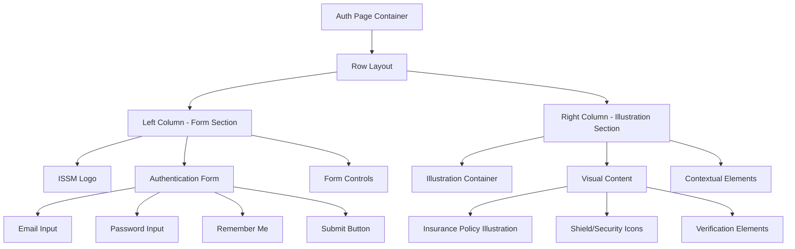
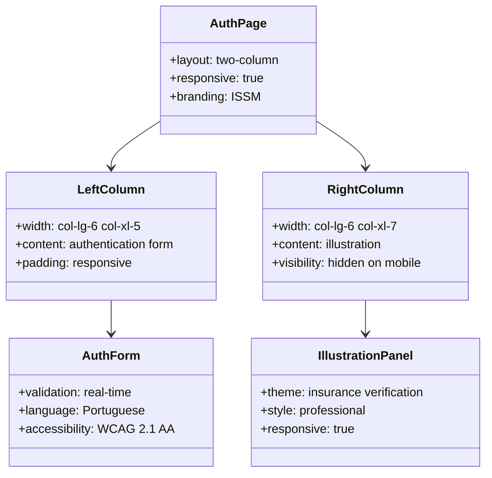
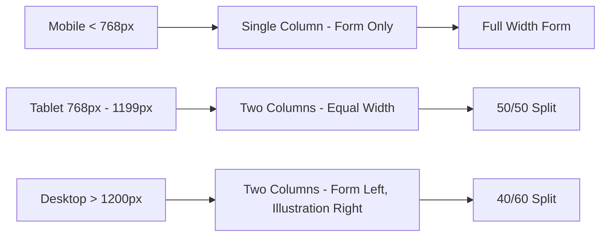

# ISSM Authentication Layout Enhancement Design

## Overview

This design document outlines the enhancement of the auth-signin.html layout for the ISSM (Instituto de Supervisão de Seguros de Moçambique) portal. The objective is to restructure the authentication page to position the login form on the left side and display a contextual illustration or image on the right side that reflects the insurance policy validation platform's purpose.

## Current State Analysis

The existing authentication page uses a standard two-column layout where:
- Left column (col-xxl-7): Contains the login form with ISSM branding
- Right column (col-xxl-5): Shows a generic placeholder image
- Form includes proper Portuguese localization and accessibility features
- ISSM branding with official logo is already implemented

## Design Requirements

### Functional Requirements
- Maintain existing authentication functionality
- Preserve form validation and accessibility features
- Keep Portuguese language localization
- Ensure responsive design across all devices
- Maintain ISSM branding consistency

### Visual Requirements
- Position login form prominently on the left side
- Replace generic image with insurance verification-themed illustration
- Create visual context for the insurance policy validation platform
- Maintain professional and trustworthy appearance
- Ensure adequate contrast and readability

## Architecture

### Layout Structure



### Component Hierarchy



## Detailed Design Specifications

### Left Column - Authentication Form

#### Layout Adjustments
- Reduce column width from `col-xxl-7` to `col-lg-6 col-xl-5`
- Maintain vertical centering and padding
- Preserve existing form structure and validation
- Keep ISSM logo positioning and branding

#### Form Container Styling
```css
.auth-form-container {
    max-width: 400px;
    margin: 0 auto;
    padding: 2rem;
}

.auth-logo-container {
    text-align: center;
    margin-bottom: 2rem;
}

.issm-auth-form {
    background: rgba(255, 255, 255, 0.95);
    border-radius: 12px;
    padding: 2rem;
    box-shadow: 0 4px 20px rgba(0, 0, 0, 0.1);
}
```

### Right Column - Illustration Panel

#### Content Strategy
Replace the generic image with insurance-themed visual elements:

1. **Primary Illustration**: Insurance policy verification concept
   - Document with shield icon overlay
   - Checkmark or validation symbols
   - Professional color scheme matching ISSM branding

2. **Supporting Elements**:
   - Security badges and trust indicators
   - Simplified workflow visualization
   - Subtle background patterns or gradients

#### Visual Specifications
```css
.illustration-panel {
    background: linear-gradient(135deg, #f8f9fa 0%, #e9ecef 100%);
    display: flex;
    align-items: center;
    justify-content: center;
    padding: 3rem;
    border-radius: 16px;
    position: relative;
    overflow: hidden;
}

.illustration-content {
    text-align: center;
    z-index: 2;
}

.verification-icon {
    font-size: 4rem;
    color: #0066cc;
    margin-bottom: 1.5rem;
}

.context-text {
    color: #6c757d;
    font-size: 1.1rem;
    font-weight: 500;
}
```

### Responsive Behavior

#### Breakpoint Strategy



#### Media Query Implementation
```css
/* Mobile - Hide illustration */
@media (max-width: 767.98px) {
    .illustration-panel {
        display: none;
    }
    .auth-form-container {
        width: 100%;
    }
}

/* Tablet - Equal columns */
@media (min-width: 768px) and (max-width: 1199.98px) {
    .auth-column {
        flex: 0 0 50%;
    }
}

/* Desktop - Optimized ratio */
@media (min-width: 1200px) {
    .auth-form-column {
        flex: 0 0 40%;
    }
    .illustration-column {
        flex: 0 0 60%;
    }
}
```

## Illustration Content Design

### Primary Visual Elements

#### Insurance Policy Document
- SVG-based illustration of an insurance policy document
- Shield icon overlay indicating security and verification
- Checkmark or validation badge
- Subtle animation on page load

#### Supporting Graphics
- Security icons (lock, shield, certificate)
- Trust indicators and badges
- Simplified verification workflow icons
- Background elements with ISSM color scheme

### Color Palette
- Primary: ISSM official blue (#0066cc)
- Secondary: Light gray (#f8f9fa)
- Accent: Success green (#28a745)
- Text: Dark gray (#495057)

### Typography Integration
- Portuguese text elements for context
- "Verificação Segura de Apólices"
- "Plataforma Oficial do ISSM"
- "Confiança e Transparência"

## Implementation Approach

### HTML Structure Updates

```html
<div class="row h-100 auth-layout">
    <!-- Left Column - Authentication Form -->
    <div class="col-lg-6 col-xl-5 auth-form-column">
        <div class="auth-form-container">
            <!-- Existing form content -->
        </div>
    </div>
    
    <!-- Right Column - Illustration -->
    <div class="col-lg-6 col-xl-7 d-none d-lg-flex illustration-column">
        <div class="illustration-panel">
            <div class="illustration-content">
                <!-- Insurance verification illustration -->
            </div>
        </div>
    </div>
</div>
```

### CSS Enhancements

#### New Stylesheet: `auth-illustration.css`
Create a dedicated stylesheet for the illustration panel styling:
- Responsive design rules
- Animation keyframes
- Color scheme variables
- Typography specifications

#### Integration with Existing Styles
- Extend `issm-portal.css` with new auth layout classes
- Maintain compatibility with existing form validation styles
- Preserve accessibility and responsive behavior

### JavaScript Considerations

#### Animation Control
```javascript
// Illustration animation controller
class AuthIllustrationController {
    constructor() {
        this.initializeAnimations();
    }
    
    initializeAnimations() {
        // Gentle entrance animations for illustration elements
        // Respect user's motion preferences
        if (!window.matchMedia('(prefers-reduced-motion: reduce)').matches) {
            this.animateElements();
        }
    }
    
    animateElements() {
        // Implement subtle animations for visual elements
    }
}
```

## Accessibility Considerations

### Visual Accessibility
- Maintain sufficient color contrast ratios
- Provide alternative text for all illustrated elements
- Ensure illustration doesn't interfere with form focus management

### Screen Reader Support
- Add appropriate ARIA labels for illustrated content
- Maintain existing form accessibility features
- Provide context for decorative elements

### Keyboard Navigation
- Ensure illustration doesn't capture focus
- Maintain tab order for form elements
- Preserve existing keyboard shortcuts

## Performance Optimization

### Image Optimization
- Use SVG format for scalable illustrations
- Implement lazy loading for non-critical visual elements
- Optimize file sizes for faster loading

### CSS Efficiency
- Use CSS variables for consistent theming
- Minimize reflow and repaint operations
- Implement efficient responsive queries

### Loading Strategy
- Prioritize form functionality over illustration loading
- Implement graceful degradation for slow connections
- Use CSS-only animations where possible

## Testing Strategy

### Cross-Browser Compatibility
- Test on major browsers (Chrome, Firefox, Safari, Edge)
- Verify responsive behavior across devices
- Validate accessibility features

### Performance Testing
- Measure page load times
- Test on various connection speeds
- Monitor rendering performance

### User Experience Testing
- Validate form usability with new layout
- Test illustration clarity and context
- Verify mobile experience quality

## Maintenance Considerations

### Content Updates
- Plan for seasonal or promotional illustration updates
- Maintain version control for visual assets
- Document illustration specifications

### Responsive Maintenance
- Regular testing across new device sizes
- Monitor browser support for CSS features
- Update breakpoints as needed

### Accessibility Compliance
- Regular accessibility audits
- Update ARIA labels as needed
- Monitor screen reader compatibility