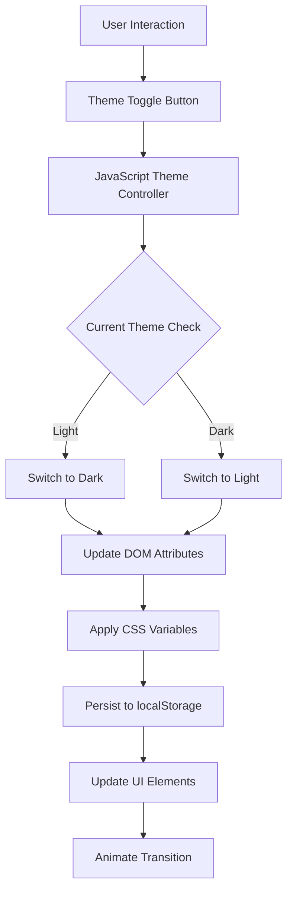
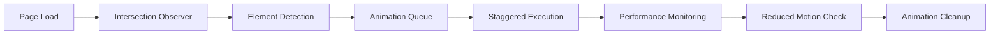

# Dark Mode Activation & Dynamic Animations for Landing Page

## Overview

This design document outlines the implementation of functional dark mode support and enhanced dynamic animations for the ISSM Portal landing page. The current landing page has partial dark mode implementation that needs to be completed and optimized, along with enhanced animations to create a more engaging user experience.

## Current State Analysis

### Existing Dark Mode Implementation
- Basic dark mode CSS selectors exist but are incomplete
- Theme toggle button is present (`landing-theme-toggle`)
- JavaScript theme switching logic is partially implemented
- Landing page specific dark mode styles need enhancement

### Animation State
- Basic CSS animations exist (fadeInUp, slideInRight, float)
- Intersection Observer API is implemented for scroll animations
- Icon animations are present but limited
- Performance optimization considerations are in place

## Architecture

### Dark Mode System Architecture



### Animation System Architecture



## Component Specifications

### Theme Management Component

#### Core Functionality
- **Theme Detection**: Automatic detection of system preference
- **Theme Persistence**: localStorage-based theme memory
- **Smooth Transitions**: Animated theme switching
- **Icon Updates**: Dynamic theme toggle icon changes

#### CSS Variable System
```css
:root {
  /* Light Theme Variables */
  --landing-bg-primary: #ffffff;
  --landing-bg-secondary: #f8f9fa;
  --landing-text-primary: #1f2937;
  --landing-text-secondary: #6b7280;
  --landing-border: rgba(0, 0, 0, 0.1);
  --landing-shadow: rgba(0, 0, 0, 0.1);
}

[data-bs-theme="dark"] {
  /* Dark Theme Variables */
  --landing-bg-primary: #1a202c;
  --landing-bg-secondary: #2d3748;
  --landing-text-primary: #f7fafc;
  --landing-text-secondary: #a0aec0;
  --landing-border: rgba(255, 255, 255, 0.1);
  --landing-shadow: rgba(0, 0, 0, 0.3);
}
```

### Animation Enhancement Components

#### Scroll-Triggered Animations
- **Fade In Animations**: Elements fade in with staggered timing
- **Slide Animations**: Directional slide effects (up, down, left, right)
- **Scale Animations**: Growth and shrink effects
- **Rotation Animations**: Subtle rotation effects for icons

#### Interactive Animations
- **Hover Effects**: Enhanced card and button hover states
- **Click Animations**: Ripple effects and button feedback
- **Focus Animations**: Keyboard navigation visual feedback
- **Loading States**: Smooth loading transitions

#### Performance Optimizations
- **GPU Acceleration**: Using transform and opacity for animations
- **Reduced Motion**: Respecting user motion preferences
- **Animation Cleanup**: Proper cleanup of animation listeners
- **Lazy Loading**: Deferred loading of non-critical animations

## Implementation Details

### Dark Mode CSS Enhancements

#### Navigation Bar Dark Mode
```css
[data-bs-theme="dark"] .landing-navbar {
  background: rgba(26, 32, 44, 0.95) !important;
  border-bottom-color: rgba(255, 255, 255, 0.1);
}

[data-bs-theme="dark"] .landing-navbar .navbar-nav .nav-link {
  color: var(--landing-text-secondary) !important;
}

[data-bs-theme="dark"] .landing-navbar .navbar-nav .nav-link:hover {
  color: var(--landing-text-primary) !important;
  background: rgba(255, 255, 255, 0.1);
}
```

#### Card Components Dark Mode
```css
[data-bs-theme="dark"] .feature-card,
[data-bs-theme="dark"] .portal-card,
[data-bs-theme="dark"] .support-card {
  background: var(--landing-bg-secondary);
  border-color: var(--landing-border);
  color: var(--landing-text-primary);
}

[data-bs-theme="dark"] .feature-card:hover,
[data-bs-theme="dark"] .portal-card:hover,
[data-bs-theme="dark"] .support-card:hover {
  box-shadow: 0 10px 30px var(--landing-shadow);
  border-color: var(--issm-primary);
}
```

#### Form Elements Dark Mode
```css
[data-bs-theme="dark"] .form-control,
[data-bs-theme="dark"] .form-select {
  background: var(--landing-bg-secondary);
  border-color: var(--landing-border);
  color: var(--landing-text-primary);
}

[data-bs-theme="dark"] .form-control:focus,
[data-bs-theme="dark"] .form-select:focus {
  background: var(--landing-bg-secondary);
  border-color: var(--issm-primary);
  box-shadow: 0 0 0 3px rgba(var(--issm-primary-rgb), 0.1);
}
```

### Enhanced Animation System

#### Advanced Scroll Animations
```javascript
const advancedScrollAnimations = {
  fadeInUp: {
    initial: { opacity: 0, transform: 'translateY(60px)' },
    animate: { opacity: 1, transform: 'translateY(0)' },
    duration: 800,
    easing: 'cubic-bezier(0.25, 0.46, 0.45, 0.94)'
  },
  
  scaleIn: {
    initial: { opacity: 0, transform: 'scale(0.8)' },
    animate: { opacity: 1, transform: 'scale(1)' },
    duration: 600,
    easing: 'cubic-bezier(0.34, 1.56, 0.64, 1)'
  },
  
  slideInLeft: {
    initial: { opacity: 0, transform: 'translateX(-60px)' },
    animate: { opacity: 1, transform: 'translateX(0)' },
    duration: 700,
    easing: 'cubic-bezier(0.25, 0.46, 0.45, 0.94)'
  }
};
```

#### Interactive Hover Effects
```css
.enhanced-hover {
  transition: all 0.3s cubic-bezier(0.25, 0.46, 0.45, 0.94);
  position: relative;
  overflow: hidden;
}

.enhanced-hover::before {
  content: '';
  position: absolute;
  top: 0;
  left: -100%;
  width: 100%;
  height: 100%;
  background: linear-gradient(90deg, transparent, rgba(255, 255, 255, 0.1), transparent);
  transition: left 0.5s ease;
}

.enhanced-hover:hover::before {
  left: 100%;
}

.enhanced-hover:hover {
  transform: translateY(-8px) scale(1.02);
  box-shadow: 0 20px 40px rgba(0, 0, 0, 0.15);
}
```

#### Staggered Animation Controller
```javascript
class StaggeredAnimationController {
  constructor(elements, options = {}) {
    this.elements = elements;
    this.options = {
      staggerDelay: 100,
      animationDuration: 600,
      easing: 'cubic-bezier(0.25, 0.46, 0.45, 0.94)',
      ...options
    };
  }
  
  animate() {
    this.elements.forEach((element, index) => {
      setTimeout(() => {
        element.classList.add('animate-in');
      }, index * this.options.staggerDelay);
    });
  }
}
```

### Theme Toggle Enhancement

#### Advanced Theme Controller
```javascript
class AdvancedThemeController {
  constructor() {
    this.themeToggle = document.getElementById('landing-theme-toggle');
    this.currentTheme = this.getStoredTheme() || this.getSystemTheme();
    this.init();
  }
  
  init() {
    this.applyTheme(this.currentTheme);
    this.bindEvents();
    this.updateIcon();
  }
  
  getSystemTheme() {
    return window.matchMedia('(prefers-color-scheme: dark)').matches ? 'dark' : 'light';
  }
  
  getStoredTheme() {
    return localStorage.getItem('landing-theme');
  }
  
  toggleTheme() {
    this.currentTheme = this.currentTheme === 'light' ? 'dark' : 'light';
    this.applyTheme(this.currentTheme);
    this.storeTheme(this.currentTheme);
    this.updateIcon();
    this.animateTransition();
  }
  
  animateTransition() {
    document.body.style.transition = 'background-color 0.3s ease, color 0.3s ease';
    setTimeout(() => {
      document.body.style.transition = '';
    }, 300);
  }
}
```

### Performance Optimizations

#### Animation Performance Monitor
```javascript
class AnimationPerformanceMonitor {
  constructor() {
    this.frameRate = 0;
    this.lastFrameTime = performance.now();
    this.frameCount = 0;
  }
  
  monitor() {
    const currentTime = performance.now();
    this.frameCount++;
    
    if (currentTime - this.lastFrameTime >= 1000) {
      this.frameRate = this.frameCount;
      this.frameCount = 0;
      this.lastFrameTime = currentTime;
      
      if (this.frameRate < 30) {
        this.reduceAnimations();
      }
    }
    
    requestAnimationFrame(() => this.monitor());
  }
  
  reduceAnimations() {
    document.body.classList.add('reduced-animations');
  }
}
```

#### Intersection Observer Optimization
```javascript
const optimizedObserver = new IntersectionObserver(
  (entries) => {
    entries.forEach(entry => {
      if (entry.isIntersecting) {
        entry.target.classList.add('animate');
        optimizedObserver.unobserve(entry.target);
      }
    });
  },
  {
    threshold: 0.1,
    rootMargin: '50px 0px -50px 0px'
  }
);
```

## User Experience Enhancements

### Accessibility Considerations

#### Reduced Motion Support
```css
@media (prefers-reduced-motion: reduce) {
  .landing-wrapper * {
    animation-duration: 0.01ms !important;
    animation-iteration-count: 1 !important;
    transition-duration: 0.01ms !important;
  }
  
  .floating-stat {
    animation: none !important;
  }
}
```

#### High Contrast Mode Support
```css
@media (prefers-contrast: high) {
  [data-bs-theme="dark"] {
    --landing-text-primary: #ffffff;
    --landing-text-secondary: #cccccc;
    --landing-border: rgba(255, 255, 255, 0.3);
  }
}
```

### Interactive Feedback System

#### Button Ripple Effects
```javascript
class RippleEffect {
  static create(button, event) {
    const ripple = document.createElement('span');
    const rect = button.getBoundingClientRect();
    const size = Math.max(rect.width, rect.height);
    const x = event.clientX - rect.left - size / 2;
    const y = event.clientY - rect.top - size / 2;
    
    ripple.style.cssText = `
      position: absolute;
      border-radius: 50%;
      background: rgba(255, 255, 255, 0.6);
      width: ${size}px;
      height: ${size}px;
      left: ${x}px;
      top: ${y}px;
      transform: scale(0);
      animation: ripple-animation 0.6s linear;
      pointer-events: none;
    `;
    
    button.appendChild(ripple);
    
    setTimeout(() => {
      ripple.remove();
    }, 600);
  }
}
```

## Testing Strategy

### Visual Regression Testing
- Screenshot comparison between light and dark modes
- Animation sequence verification
- Cross-browser compatibility testing
- Mobile responsiveness validation

### Performance Testing
- Frame rate monitoring during animations
- Memory usage during theme transitions
- Load time impact assessment
- Accessibility compliance verification

### User Acceptance Testing
- Theme preference persistence testing
- Animation smoothness evaluation
- Interactive element responsiveness
- Mobile gesture compatibility

## Browser Compatibility

### Supported Features
- CSS Custom Properties (IE 11+)
- Intersection Observer API (Chrome 58+, Firefox 55+)
- CSS Grid and Flexbox (IE 11+ with prefixes)
- CSS Animations and Transitions (All modern browsers)

### Fallback Strategies
- Graceful degradation for older browsers
- Reduced animation complexity for low-performance devices
- Alternative interaction methods for touch devices
- Basic theme switching without animations for unsupported browsers

## Technical Considerations

### Performance Metrics
- **First Contentful Paint**: < 1.5s
- **Largest Contentful Paint**: < 2.5s
- **Animation Frame Rate**: 60fps target
- **Theme Switch Duration**: < 300ms

### Optimization Techniques
- CSS `will-change` property for animated elements
- GPU acceleration using `transform3d()`
- Debounced scroll event handlers
- Lazy loading of non-critical animations

### Maintenance Requirements
- Regular performance audits
- Animation library updates
- Browser compatibility testing
- User feedback integration