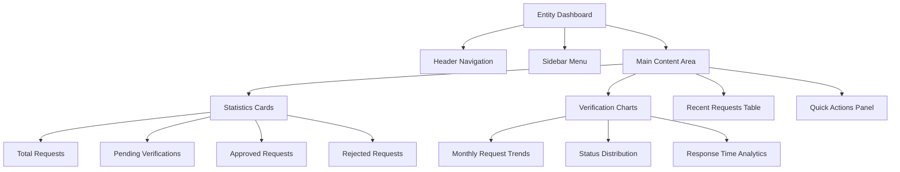
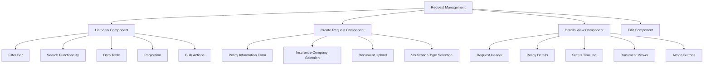
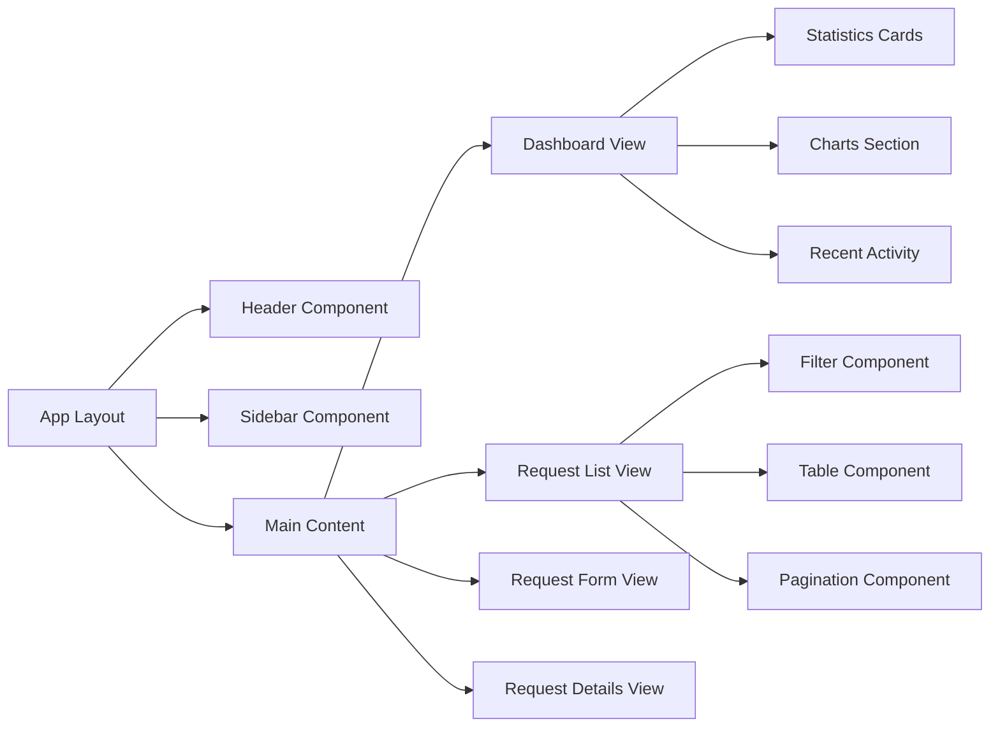
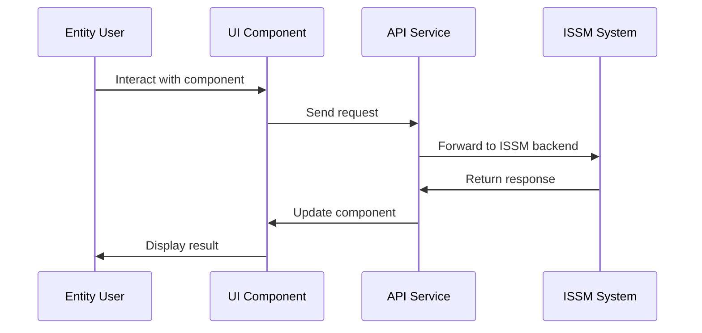
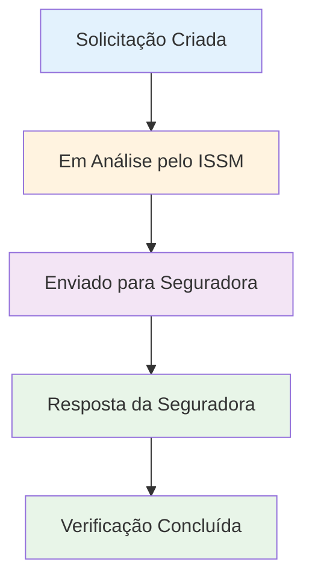

# Dashboard and Request Management System for Entities - Insurance Policy Verification Platform

## Overview

This design document outlines the dashboard and request management system for various entities that will request insurance policy verifications through the ISSM (Instituto de Supervisão de Seguros de Moçambique) platform. The system serves as the third major component of the insurance verification platform, specifically designed for entities that need to verify insurance policies.

### Platform Stakeholders
1. **ISSM (Instituto de Supervisão de Seguros de Moçambique)** - The supervisory institution
2. **Insurance Companies of Mozambique** - Policy issuers
3. **Various Entities** - Organizations requesting policy verifications (focus of this design)

### Purpose
The entity dashboard and request management system enables organizations to efficiently submit, track, and manage insurance policy verification requests while providing comprehensive insights into their verification activities.

## Technology Stack & Dependencies

### Frontend Framework
- **HTML5** with Bootstrap 5.x framework
- **Larkon Admin Template** - Responsive admin dashboard template
- **CSS Framework**: Bootstrap + Custom CSS
- **Icons**: Boxicons and Iconify icons
- **JavaScript**: Vanilla JS with component libraries

### UI Components & Libraries
- **Charts**: ApexCharts for data visualization
- **Forms**: Bootstrap form components with validation
- **Tables**: Bootstrap tables with GridJS for advanced features
- **Date Picker**: Flatpickr for date selection
- **Toast Notifications**: Toastify for user feedback
- **Modals**: Bootstrap modals for overlays

### File Structure
```
entidades/
├── index.html                    # Entity Dashboard
├── verificacoes-lista.html       # Verification Requests List
├── verificacao-criar.html        # Create New Verification Request
├── verificacao-detalhes.html     # Request Details View
├── verificacao-editar.html       # Edit Request
├── perfil-entidade.html          # Entity Profile
└── assets/ (shared with main template)
```

## Component Architecture

### Dashboard Components

#### 1. Main Dashboard Layout (`index.html`)


#### 2. Request Management Components



### Component Hierarchy



### State Management Approach

#### Local State Management
- **Form State**: Managed through vanilla JavaScript form handling
- **UI State**: Component-level state for modals, dropdowns, and interactive elements
- **Table State**: GridJS internal state for sorting, filtering, and pagination

#### Data Flow Pattern


## Routing & Navigation

### Navigation Structure
```
Entity Portal
├── Dashboard (/entidades/)
├── Verificações
│   ├── Lista (/entidades/verificacoes-lista.html)
│   ├── Nova Solicitação (/entidades/verificacao-criar.html)
│   ├── Detalhes (/entidades/verificacao-detalhes.html?id=:id)
│   └── Editar (/entidades/verificacao-editar.html?id=:id)
├── Perfil (/entidades/perfil-entidade.html)
└── Configurações (/entidades/configuracoes.html)
```

### Sidebar Menu Configuration
```javascript
// Menu structure for entities
const sidebarMenuItems = [
    {
        label: "Dashboard",
        url: "index.html",
        icon: "solar:widget-2-bold-duotone"
    },
    {
        label: "Verificações",
        icon: "solar:document-medicine-bold-duotone",
        submenu: [
            { label: "Todas as Solicitações", url: "verificacoes-lista.html" },
            { label: "Nova Solicitação", url: "verificacao-criar.html" },
            { label: "Rascunhos", url: "verificacoes-lista.html?status=draft" }
        ]
    },
    {
        label: "Relatórios",
        url: "relatorios.html",
        icon: "solar:chart-bold-duotone"
    },
    {
        label: "Perfil",
        url: "perfil-entidade.html",
        icon: "solar:user-bold-duotone"
    }
];
```

## Styling Strategy

### CSS Architecture
- **Base Styles**: Larkon template core CSS (`app.min.css`)
- **Component Styles**: Bootstrap utility classes
- **Custom Styles**: Entity-specific customizations
- **Theme Support**: Light/Dark mode toggle functionality

### Color Scheme
```css
:root {
    /* Primary Colors - ISSM Branding */
    --issm-primary: #1e40af;
    --issm-secondary: #3b82f6;
    --issm-accent: #10b981;
    
    /* Status Colors */
    --status-pending: #f59e0b;
    --status-approved: #10b981;
    --status-rejected: #ef4444;
    --status-in-review: #8b5cf6;
}
```

### Responsive Design
- **Mobile First**: Bootstrap's responsive grid system
- **Breakpoints**: Standard Bootstrap breakpoints (xs, sm, md, lg, xl, xxl)
- **Component Adaptation**: Mobile-optimized table views, collapsible sidebar

## API Integration Layer

### Entity Service Layer
```javascript
class EntityAPIService {
    constructor() {
        this.baseURL = '/api/entidades';
    }
    
    // Dashboard data
    async getDashboardStats() {
        return await this.makeRequest('GET', '/dashboard/stats');
    }
    
    // Verification requests
    async getVerificationRequests(filters = {}) {
        return await this.makeRequest('GET', '/verificacoes', { params: filters });
    }
    
    async createVerificationRequest(requestData) {
        return await this.makeRequest('POST', '/verificacoes', requestData);
    }
    
    async getVerificationDetails(requestId) {
        return await this.makeRequest('GET', `/verificacoes/${requestId}`);
    }
    
    async updateVerificationRequest(requestId, updateData) {
        return await this.makeRequest('PUT', `/verificacoes/${requestId}`, updateData);
    }
}
```

### Data Models
```typescript
interface VerificationRequest {
    id: string;
    policyNumber: string;
    insuranceCompany: string;
    requestType: 'validity' | 'coverage' | 'claims_history';
    status: 'pending' | 'in_review' | 'approved' | 'rejected';
    requestDate: Date;
    responseDate?: Date;
    requestedBy: string;
    documents: Document[];
    verificationResult?: VerificationResult;
}

interface EntityDashboardStats {
    totalRequests: number;
    pendingRequests: number;
    approvedRequests: number;
    rejectedRequests: number;
    averageResponseTime: number;
    monthlyTrends: MonthlyData[];
}
```

## Page Specifications

### 1. Entity Dashboard (`index.html`)

#### Statistics Cards Section
```html
<div class="row">
    <div class="col-md-3">
        <div class="card">
            <div class="card-body">
                <div class="d-flex align-items-center">
                    <div class="flex-shrink-0">
                        <iconify-icon icon="solar:document-bold-duotone" class="fs-2 text-primary"></iconify-icon>
                    </div>
                    <div class="flex-grow-1 ms-3">
                        <h5 class="mb-0" id="total-requests">0</h5>
                        <p class="text-muted mb-0">Total de Solicitações</p>
                    </div>
                </div>
            </div>
        </div>
    </div>
    <!-- Additional stat cards... -->
</div>
```

#### Charts Section
- **Monthly Request Trends**: Line chart showing request volume over time
- **Status Distribution**: Pie chart showing request status breakdown
- **Response Time Analytics**: Bar chart showing average response times

#### Recent Requests Table
- **Columns**: Request ID, Policy Number, Insurance Company, Status, Date, Actions
- **Features**: Quick status filtering, inline actions, responsive design

### 2. Verification Requests List (`verificacoes-lista.html`)

#### Filter and Search Section
```html
<div class="row mb-3">
    <div class="col-md-6">
        <div class="input-group">
            <input type="text" class="form-control" placeholder="Buscar por número da apólice...">
            <button class="btn btn-outline-secondary" type="button">
                <iconify-icon icon="solar:magnifer-linear"></iconify-icon>
            </button>
        </div>
    </div>
    <div class="col-md-6">
        <div class="d-flex gap-2">
            <select class="form-select" id="status-filter">
                <option value="">Todos os Status</option>
                <option value="pending">Pendente</option>
                <option value="in_review">Em Análise</option>
                <option value="approved">Aprovado</option>
                <option value="rejected">Rejeitado</option>
            </select>
            <select class="form-select" id="company-filter">
                <option value="">Todas as Seguradoras</option>
            </select>
        </div>
    </div>
</div>
```

#### Table Configuration
- **Sortable Columns**: Date, Status, Insurance Company
- **Row Actions**: View Details, Edit (if pending), Download Certificate
- **Bulk Actions**: Export selected, Delete drafts

### 3. Create Verification Request (`verificacao-criar.html`)

#### Form Sections
1. **Policy Information**
   - Policy Number (required)
   - Insurance Company Selection (dropdown)
   - Policy Holder Information
   - Coverage Type

2. **Verification Details**
   - Verification Type (radio buttons)
   - Urgency Level
   - Additional Notes

3. **Document Upload**
   - Policy Document (PDF)
   - Additional Supporting Documents
   - Drag & Drop Interface

#### Form Validation
```javascript
const validationRules = {
    policyNumber: { required: true, pattern: /^[A-Z0-9]{8,15}$/ },
    insuranceCompany: { required: true },
    verificationType: { required: true },
    policyDocument: { required: true, fileType: ['pdf'] }
};
```

### 4. Request Details View (`verificacao-detalhes.html`)

#### Layout Structure
```html
<div class="row">
    <div class="col-lg-8">
        <!-- Request Details -->
        <div class="card">
            <div class="card-header">
                <h5>Detalhes da Solicitação #REQ-2024-001</h5>
                <span class="badge bg-warning">Pendente</span>
            </div>
            <div class="card-body">
                <!-- Policy information display -->
            </div>
        </div>
        
        <!-- Status Timeline -->
        <div class="card mt-3">
            <div class="card-header">
                <h5>Histórico da Solicitação</h5>
            </div>
            <div class="card-body">
                <!-- Timeline component -->
            </div>
        </div>
    </div>
    
    <div class="col-lg-4">
        <!-- Actions Panel -->
        <div class="card">
            <div class="card-header">
                <h5>Ações</h5>
            </div>
            <div class="card-body">
                <!-- Action buttons -->
            </div>
        </div>
        
        <!-- Documents Panel -->
        <div class="card mt-3">
            <div class="card-header">
                <h5>Documentos</h5>
            </div>
            <div class="card-body">
                <!-- Document list -->
            </div>
        </div>
    </div>
</div>
```

#### Status Timeline Component


## Testing Strategy

### Component Testing
- **Form Validation**: Test all validation rules and error messages
- **Table Functionality**: Test sorting, filtering, and pagination
- **Chart Rendering**: Verify chart data accuracy and responsiveness
- **Modal Interactions**: Test all modal open/close scenarios

### Integration Testing
- **API Endpoints**: Test all CRUD operations
- **File Upload**: Test document upload functionality
- **Authentication**: Test session management and permissions

### User Acceptance Testing
- **Workflow Testing**: Complete request lifecycle testing
- **Usability Testing**: Navigation and user experience validation
- **Performance Testing**: Page load times and responsiveness

### Test Scenarios
```markdown
## Test Cases

### Dashboard
- [ ] Statistics cards display correct data
- [ ] Charts render properly on different screen sizes
- [ ] Recent requests table shows accurate information
- [ ] Quick actions work correctly

### Request Management
- [ ] Create new verification request
- [ ] Upload and validate documents
- [ ] Filter and search requests
- [ ] View request details
- [ ] Edit pending requests
- [ ] Download verification certificates

### Navigation & UX
- [ ] Sidebar navigation works on all screen sizes
- [ ] Breadcrumb navigation is accurate
- [ ] Page transitions are smooth
- [ ] Error messages are clear and helpful
```

## Security Considerations

### Authentication & Authorization
- **Session Management**: Secure session handling for entity users
- **Role-Based Access**: Entities can only view their own requests
- **API Security**: Token-based authentication for API calls

### Data Protection
- **Document Security**: Secure upload and storage of policy documents
- **Data Encryption**: Sensitive data encryption in transit and at rest
- **Audit Trail**: Complete audit log of all user actions

### Input Validation
- **Client-Side**: Form validation for user experience
- **Server-Side**: Comprehensive validation on the backend
- **File Upload**: Secure file validation and virus scanning