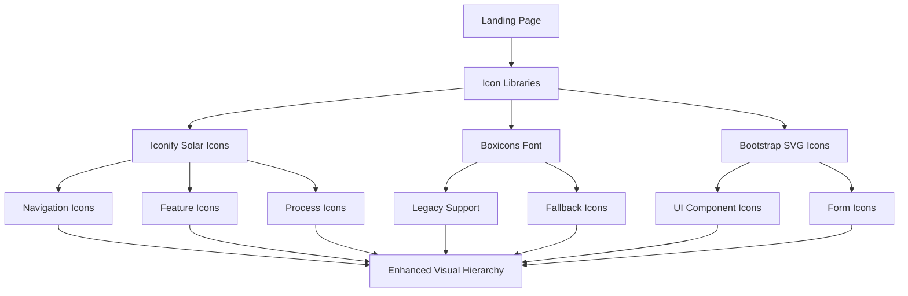
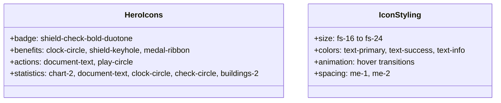
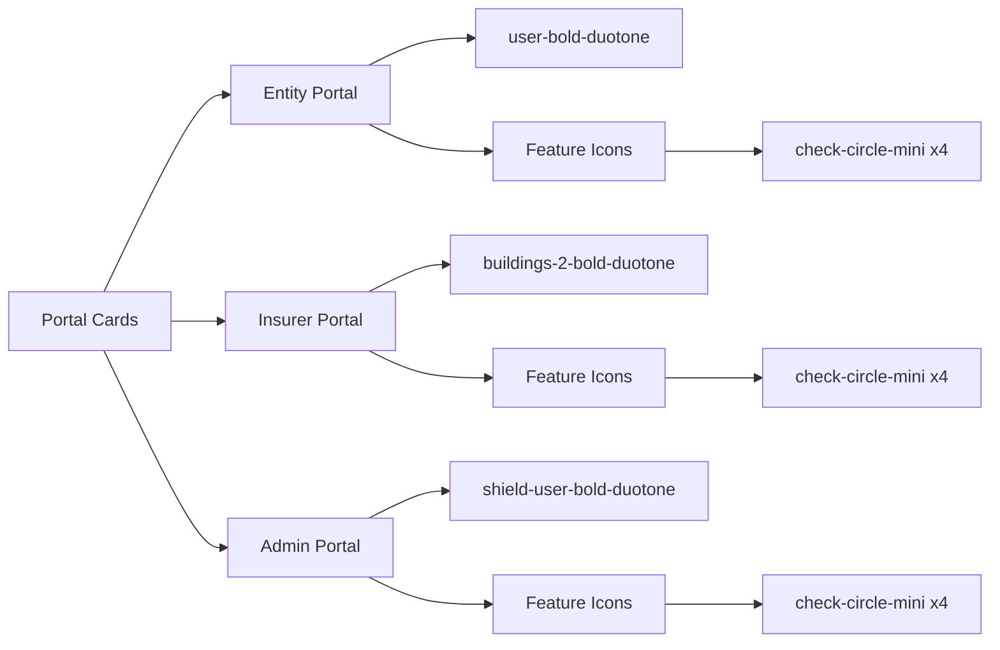

# Icon Integration for ISSM Landing Page

## Overview

This design document outlines the integration of the existing icon libraries (Iconify and Boxicons) from the template into the ISSM Portal landing page to enhance visual communication and user experience. The landing page currently displays icons using Iconify, but lacks systematic use and consistent styling patterns found throughout the rest of the application.

## Technology Stack

### Icon Libraries in Use
- **Iconify Icons**: Solar icon set via `<iconify-icon>` elements
- **Boxicons**: Font-based icons via CSS classes (`.bx-*`)
- **Bootstrap Icons**: Embedded SVG icons in CSS

### Current Implementation
The landing page already includes:
- `icons.min.css` - Contains Boxicons font definitions and styling
- Iconify Solar icons via CDN
- Custom icon styling in `landing-page.css`

## Architecture

### Icon System Overview



### Icon Usage Patterns

#### Primary Icon Library (Iconify Solar)
Currently implemented throughout the landing page using the pattern:
```html
<iconify-icon icon="solar:icon-name-style" class="size-class color-class"></iconify-icon>
```

#### Secondary Icon Library (Boxicons)
Available for fallback and additional variety:
```html
<i class="bx bx-icon-name size-class color-class"></i>
```

## Enhanced Icon Integration Strategy

### Icon Categories and Usage

#### 1. Navigation Icons
**Current State**: Basic hamburger menu and theme toggle
**Enhancement**: Add visual indicators for all navigation elements

| Element | Current Icon | Enhanced Icon | Purpose |
|---------|-------------|---------------|---------|
| Home | None | `solar:home-bold-duotone` | Navigation clarity |
| How It Works | None | `solar:settings-bold-duotone` | Process indication |
| Portals | None | `solar:widget-bold-duotone` | Portal access |
| Support | None | `solar:chat-round-bold-duotone` | Help indication |
| Login Button | None | `solar:login-3-bold-duotone` | Action clarity |

#### 2. Hero Section Icons
**Current State**: Well-implemented with contextual icons
**Enhancement**: Maintain consistency and add micro-interactions



#### 3. Process Section Icons
**Current State**: Good implementation with numbered steps
**Enhancement**: Add supporting micro-icons and hover effects

| Step | Main Icon | Micro Icons | Purpose |
|------|-----------|------------|---------|
| Submit | `document-add-bold-duotone` | `shield-keyhole-mini`, `clock-circle-mini` | Security & Speed |
| Verify | `shield-check-bold-duotone` | `medal-ribbon-star-mini`, `check-circle-mini` | Official & Reliable |
| Receive | `document-text-bold-duotone` | `download-mini`, `document-mini` | Download & Certificate |

#### 4. Features Section Icons
**Current State**: Well-implemented with appropriate icons
**Enhancement**: Add icon animations and improve semantic meaning

| Feature | Icon | Enhancement |
|---------|------|-------------|
| Security | `shield-keyhole-bold-duotone` | Add pulse animation |
| Speed | `clock-circle-bold-duotone` | Add rotation on hover |
| Reliability | `medal-ribbon-star-bold-duotone` | Add bounce effect |
| Accessibility | `smartphone-bold-duotone` | Add device transition |

#### 5. Portal Section Icons
**Current State**: Good categorization with distinct icons
**Enhancement**: Add portal-specific micro-icons and status indicators



#### 6. Support Section Icons
**Current State**: Basic implementation
**Enhancement**: Add contextual icons and visual hierarchy

| Element | Icon | Purpose |
|---------|------|---------|
| FAQ | `question-circle-bold-duotone` | Question identification |
| Contact | `phone-bold-duotone` | Communication method |
| Info Box | `info-circle-bold-duotone` | Information highlight |
| Arrow Links | `arrow-right-linear` | Action direction |

### Icon Styling Framework

#### Size Classes
```css
.icon-xs { font-size: 0.75rem; }    /* 12px - micro icons */
.icon-sm { font-size: 0.875rem; }   /* 14px - inline icons */
.icon-md { font-size: 1rem; }       /* 16px - standard icons */
.icon-lg { font-size: 1.25rem; }    /* 20px - emphasis icons */
.icon-xl { font-size: 1.5rem; }     /* 24px - hero icons */
.icon-2xl { font-size: 2rem; }      /* 32px - feature icons */
.icon-3xl { font-size: 2.5rem; }    /* 40px - portal icons */
```

#### Color Classes
```css
.icon-primary { color: var(--issm-primary); }
.icon-secondary { color: var(--issm-secondary); }
.icon-success { color: #22c55e; }
.icon-warning { color: #f59e0b; }
.icon-info { color: #3b82f6; }
.icon-muted { color: #6b7280; }
```

#### Animation Classes
```css
.icon-hover-pulse:hover { animation: pulse 0.6s ease-in-out; }
.icon-hover-bounce:hover { animation: bounce 0.6s ease-in-out; }
.icon-hover-rotate:hover { transform: rotate(15deg); }
.icon-hover-scale:hover { transform: scale(1.1); }
```

### Enhanced Icon Implementation

#### Navigation Enhancement
```html
<ul class="navbar-nav ms-auto align-items-center">
    <li class="nav-item">
        <a class="nav-link" href="#home">
            <iconify-icon icon="solar:home-bold-duotone" class="icon-sm me-1"></iconify-icon>
            Início
        </a>
    </li>
    <li class="nav-item">
        <a class="nav-link" href="#como-funciona">
            <iconify-icon icon="solar:settings-bold-duotone" class="icon-sm me-1"></iconify-icon>
            Como Funciona
        </a>
    </li>
    <li class="nav-item">
        <a class="nav-link" href="#portais">
            <iconify-icon icon="solar:widget-bold-duotone" class="icon-sm me-1"></iconify-icon>
            Portais
        </a>
    </li>
    <li class="nav-item">
        <a class="nav-link" href="#suporte">
            <iconify-icon icon="solar:chat-round-bold-duotone" class="icon-sm me-1"></iconify-icon>
            Suporte
        </a>
    </li>
</ul>
```

#### Process Card Enhancement
```html
<div class="process-features">
    <span class="feature-tag">
        <iconify-icon icon="solar:shield-keyhole-mini-bold" class="icon-xs"></iconify-icon>
        Seguro
    </span>
    <span class="feature-tag">
        <iconify-icon icon="solar:clock-circle-mini-bold" class="icon-xs"></iconify-icon>
        Rápido
    </span>
    <span class="feature-tag">
        <iconify-icon icon="solar:medal-ribbon-star-mini-bold" class="icon-xs"></iconify-icon>
        Oficial
    </span>
</div>
```

#### Feature Card Enhancement
```html
<div class="feature-card">
    <div class="feature-icon">
        <iconify-icon icon="solar:shield-keyhole-bold-duotone" 
                      class="icon-2xl icon-primary icon-hover-pulse"></iconify-icon>
    </div>
    <h5>Segurança Total</h5>
    <p>Todos os dados são protegidos com criptografia avançada e protocolos de segurança.</p>
</div>
```

### Accessibility Considerations

#### Icon Accessibility Pattern
```html
<iconify-icon icon="solar:shield-check-bold-duotone" 
              class="me-1" 
              aria-label="Verificação segura"
              role="img"></iconify-icon>
```

#### Screen Reader Support
- All decorative icons use `aria-hidden="true"`
- Meaningful icons include `aria-label` descriptions
- Icon-only buttons include `aria-label` or `title` attributes
- Portuguese language descriptions for all accessibility labels

### Performance Considerations

#### Icon Loading Strategy
1. **Iconify Solar Icons**: Loaded via CDN with optimized SVG delivery
2. **Boxicons**: Font-based loading for fallback scenarios
3. **Lazy Loading**: Icons below fold load on scroll
4. **Caching**: Icons cached for repeat visits

#### Bundle Optimization
- Only load required icon variants
- Use Iconify's tree-shaking capabilities
- Implement icon sprite sheets for frequently used icons
- Optimize SVG icons for smaller file sizes

### Browser Support

#### Icon Rendering Compatibility
- **Iconify**: Modern browsers with SVG support
- **Boxicons**: All browsers with font support
- **Fallback**: Text labels for non-supporting browsers
- **Progressive Enhancement**: Icons enhance but don't break functionality

### Testing Strategy

#### Visual Testing
- Cross-browser icon rendering verification
- Mobile responsive icon sizing
- High-contrast mode compatibility
- Icon alignment and spacing validation

#### Accessibility Testing
- Screen reader compatibility testing
- Keyboard navigation with icon buttons
- Color contrast ratio validation
- Focus indicator visibility

#### Performance Testing
- Icon loading time measurements
- Bundle size impact analysis
- Network request optimization
- Cache effectiveness monitoring