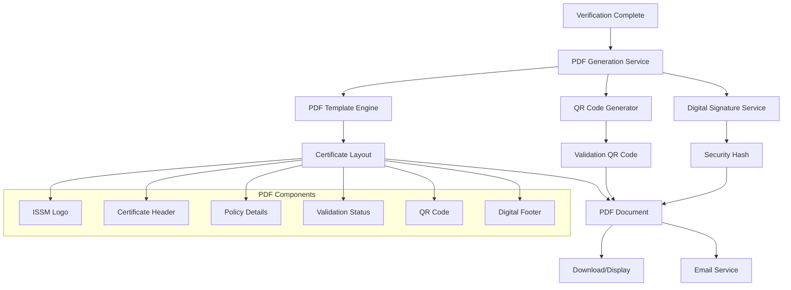

# Insurance Policy Confirmation PDF Design

## Overview

This design document outlines the implementation of an insurance policy confirmation PDF generation feature for the ISSM Portal das Entidades. The feature will generate a professional PDF certificate confirming the validity of an insurance policy verification, complete with QR code validation and ISSM branding.

## Architecture

### Component Structure



### System Integration

``mermaid
sequenceDiagram
    participant E as Entity Portal
    participant V as Verification Service
    participant P as PDF Generator
    participant Q as QR Service
    participant S as Storage Service
    
    E->>V: Request PDF Generation
    V->>V: Validate Verification Status
    V->>P: Prepare Certificate Data
    P->>Q: Generate QR Code
    Q-->>P: QR Code Image
    P->>P: Render PDF Template
    P->>S: Store PDF Document
    S-->>P: Storage URL
    P-->>V: PDF Generation Complete
    V-->>E: PDF Ready for Download
```

## PDF Certificate Layout

### Page Structure

The PDF certificate will follow a modern, professional layout with the following sections:

| Section | Content | Styling |
|---------|---------|---------|
| **Header** | ISSM Logo, Certificate Title | Branded header with gradient |
| **Certificate Info** | Certificate number, issue date | Formal document details |
| **Policy Details** | Policy number, insurer, insured party | Structured data presentation |
| **Verification Status** | Validation result, validity period | Status indicators with colors |
| **QR Code** | Validation QR code with URL | Security verification element |
| **Footer** | Digital signature, disclaimer | Official footer with security info |

### Visual Design Elements

``mermaid
graph LR
    subgraph "Certificate Design"
        A[Header Section<br/>- ISSM Logo (56px height)<br/>- Certificate Title<br/>- Issue Date] 
        B[Main Content<br/>- Policy Information<br/>- Verification Details<br/>- Status Badge]
        C[Validation Section<br/>- QR Code (120x120px)<br/>- Validation URL<br/>- Security Hash]
        D[Footer Section<br/>- Digital Signature<br/>- Disclaimer Text<br/>- Contact Information]
    end
    
    A --> B
    B --> C
    C --> D
```

### Color Scheme and Branding

Following ISSM branding guidelines:

- **Primary Color**: `#d78b29` (ISSM Gold)
- **Secondary Color**: `#2b6cb0` (ISSM Blue)
- **Accent Color**: `#3182ce` (Light Blue)
- **Text Colors**: `#1f2937` (Dark Gray), `#6b7280` (Medium Gray)
- **Background**: `#ffffff` (White) with subtle gradients

## Technical Implementation

### PDF Generation Service

``mermaid
classDiagram
    class PDFCertificateService {
        +generateCertificate(verificationData)
        +renderTemplate(templateData)
        +addQRCode(validationUrl)
        +applyDigitalSignature()
        +savePDF(documentPath)
        -validateVerificationData(data)
        -generateSecurityHash(data)
        -createValidationUrl(certId)
    }
    
    class QRCodeGenerator {
        +generateQR(data, size)
        +encodeValidationData(certData)
        +createSecureUrl(certId, hash)
        -validateQRData(data)
    }
    
    class CertificateTemplate {
        +headerSection()
        +policyDetailsSection()
        +validationSection()
        +footerSection()
        +applyBranding()
        -formatDate(date)
        -formatPolicyData(data)
    }
    
    PDFCertificateService --> QRCodeGenerator
    PDFCertificateService --> CertificateTemplate
```

### File Structure

```
entidades/
├── certificado-validacao.html          # PDF preview/display page
├── assets/
│   ├── css/
│   │   └── certificate-pdf.css         # Certificate-specific styles
│   ├── js/
│   │   ├── services/
│   │   │   └── pdf-generation-service.js   # PDF generation logic
│   │   └── pages/
│   │       └── certificate-validation.js   # Certificate page controller
│   └── templates/
│       └── certificate-template.html   # PDF template structure
```

### Data Model

``mermaid
erDiagram
    VERIFICATION ||--|| CERTIFICATE : generates
    CERTIFICATE ||--|| QR_CODE : contains
    CERTIFICATE ||--|| DIGITAL_SIGNATURE : secured_by
    
    VERIFICATION {
        string id
        string policyNumber
        string insuranceCompany
        string insuredName
        string status
        datetime verificationDate
        string verificationType
    }
    
    CERTIFICATE {
        string certificateId
        string verificationId
        datetime issueDate
        datetime expiryDate
        string validationUrl
        string securityHash
        string pdfPath
    }
    
    QR_CODE {
        string qrId
        string certificateId
        string validationData
        string qrImagePath
        datetime createdAt
    }
    
    DIGITAL_SIGNATURE {
        string signatureId
        string certificateId
        string algorithm
        string signature
        datetime signedAt
    }
```

## User Interface Components

### Certificate Display Page

The certificate display page (`certificado-validacao.html`) will include:

1. **Page Header**
   - ISSM branding
   - Page title: "Certificado de Validação de Apólice"
   - Navigation breadcrumb

2. **Certificate Preview**
   - PDF viewer embedded in page
   - Download button
   - Print button
   - Share options

3. **Certificate Actions**
   - Download PDF
   - Send via email
   - Copy validation URL
   - Verify QR code

### PDF Template Structure

``html
<!-- Certificate Template Structure -->
<div class="certificate-container">
    <header class="certificate-header">
        
        <h1>Certificado de Validação de Apólice</h1>
        <div class="certificate-number">Certificado Nº: {CERTIFICATE_ID}</div>
    </header>
    
    <main class="certificate-content">
        <section class="policy-details">
            <h2>Detalhes da Apólice</h2>
            <table class="details-table">
                <tr>
                    <td>Número da Apólice:</td>
                    <td>{POLICY_NUMBER}</td>
                </tr>
                <tr>
                    <td>Seguradora:</td>
                    <td>{INSURANCE_COMPANY}</td>
                </tr>
                <tr>
                    <td>Segurado:</td>
                    <td>{INSURED_NAME}</td>
                </tr>
                <tr>
                    <td>Tipo de Verificação:</td>
                    <td>{VERIFICATION_TYPE}</td>
                </tr>
            </table>
        </section>
        
        <section class="validation-status">
            <div class="status-badge {STATUS_CLASS}">
                <span class="status-text">{VALIDATION_STATUS}</span>
            </div>
            <p>Data da Verificação: {VERIFICATION_DATE}</p>
            <p>Válido até: {EXPIRY_DATE}</p>
        </section>
        
        <section class="qr-validation">
            <div class="qr-code">
                
            </div>
            <p class="validation-url">{VALIDATION_URL}</p>
        </section>
    </main>
    
    <footer class="certificate-footer">
        <div class="digital-signature">
            <p>Documento assinado digitalmente pelo ISSM</p>
            <p>Hash de Segurança: {SECURITY_HASH}</p>
        </div>
        <div class="disclaimer">
            <p>Este certificado é válido apenas para verificação da validade da apólice de seguros especificada.</p>
        </div>
    </footer>
</div>
```

## QR Code Implementation

### QR Code Data Structure

The QR code will encode the following validation data:

```json
{
    "certificateId": "CERT-2024-001",
    "verificationId": "REQ-2024-001",
    "issueDate": "2024-01-15T10:30:00Z",
    "validationUrl": "https://portal.issm.co.mz/validate/CERT-2024-001",
    "securityHash": "sha256:a1b2c3d4e5f6...",
    "version": "1.0"
}
```

### Validation Flow

``mermaid
flowchart TD
    A[Scan QR Code] --> B[Extract Certificate ID]
    B --> C[Access Validation URL]
    C --> D[Verify Security Hash]
    D --> E{Valid Certificate?}
    E -->|Yes| F[Display Certificate Details]
    E -->|No| G[Show Error Message]
    F --> H[Show Validation Status]
    G --> I[Security Warning]
```

## Security Features

### Digital Signature

- **Algorithm**: SHA-256 with RSA encryption
- **Certificate Authority**: ISSM internal CA
- **Signature includes**: Certificate content, timestamp, issuer identity

### QR Code Security

- **Encryption**: AES-256 encryption of QR data
- **Tamper Detection**: Security hash validation
- **Expiry**: Time-based validation tokens

### PDF Security

- **Password Protection**: Optional password protection
- **Print Restrictions**: Configurable print permissions
- **Copy Protection**: Text extraction limitations

## Integration Points

### Verification Workflow Integration

The PDF generation will be triggered at the following points:

1. **Automatic Generation**: When verification status changes to "approved"
2. **Manual Generation**: Via button click in verification details page
3. **Bulk Generation**: For multiple verifications via admin panel

### Email Integration

``mermaid
graph LR
    A[PDF Generated] --> B[Email Service]
    B --> C[Compose Email]
    C --> D[Attach PDF]
    D --> E[Send to Entity]
    E --> F[Log Email Activity]
```

### Storage Integration

- **File Storage**: PDFs stored in secure cloud storage
- **Database Records**: Certificate metadata in database
- **Backup Strategy**: Automated backups with retention policy

## Testing Strategy

### Unit Testing

- PDF generation service tests
- QR code generation tests
- Template rendering tests
- Security validation tests

### Integration Testing

- End-to-end verification workflow
- Email delivery testing
- QR code validation flow
- Cross-browser PDF display

### Performance Testing

- PDF generation speed
- Large batch processing
- Concurrent generation requests
- Memory usage optimization

## Accessibility Considerations

### PDF Accessibility

- **Structure Tags**: Proper PDF structure for screen readers
- **Alt Text**: Alternative text for images and QR codes
- **Color Contrast**: WCAG 2.1 AA compliant color ratios
- **Font Sizes**: Minimum 12pt font size for readability

### Web Interface Accessibility

- **Keyboard Navigation**: Full keyboard accessibility
- **Screen Reader Support**: ARIA labels and descriptions
- **High Contrast Mode**: Support for high contrast themes
- **Reduced Motion**: Respect user motion preferences
