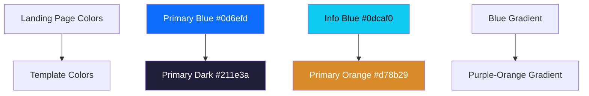

# Landing Page Color Adjustment Design

## Overview

The ISSM Portal landing page currently uses inconsistent colors compared to the main template. The landing page uses blue colors (`#0d6efd`) while the main template uses the official ISSM primary color scheme (`#211e3a` and `#d78b29`). This design document outlines the necessary color adjustments to ensure visual consistency across the entire portal.

## Current Color Analysis

### Landing Page Colors (Current - Inconsistent)
- Primary Blue: `#0d6efd` 
- Info Blue: `#0dcaf0`
- Gradient: `linear-gradient(135deg, #0d6efd 0%, #0dcaf0 100%)`

### Template Primary Colors (Target - Consistent)
- Primary Dark: `#211e3a`
- Primary Orange: `#d78b29` 
- Secondary: `#5d7186`
- Success: `#22c55e`
- Warning: `#f9b931`
- Danger: `#ef5f5f`

## Color Mapping Strategy



## File Modifications Required

### 1. Landing Page Inline Styles (landing.html)

**Current CSS Variables (Lines 28-34):**
```css
:root {
    --issm-primary: #0d6efd;
    --issm-secondary: #6c757d;
    --issm-success: #198754;
    --issm-info: #0dcaf0;
    --issm-warning: #ffc107;
    --issm-danger: #dc3545;
    --issm-light: #f8f9fa;
    --issm-dark: #212529;
    --issm-gradient: linear-gradient(135deg, #0d6efd 0%, #0dcaf0 100%);
}
```

**Target CSS Variables:**
```css
:root {
    --issm-primary: #211e3a;
    --issm-secondary: #5d7186;
    --issm-success: #22c55e;
    --issm-info: #4ecac2;
    --issm-warning: #f9b931;
    --issm-danger: #ef5f5f;
    --issm-light: #f8f9fa;
    --issm-dark: #323a46;
    --issm-gradient: linear-gradient(135deg, #211e3a 0%, #d78b29 100%);
}
```

### 2. Landing Page CSS File (assets/css/landing-page.css)

**Current Text Gradient (Line 9):**
```css
--landing-text-gradient: linear-gradient(135deg, #d78b29 0%, #2b6cb0 100%);
```

**Target Text Gradient:**
```css
--landing-text-gradient: linear-gradient(135deg, #d78b29 0%, #211e3a 100%);
```

**Current Feature Tag Styling (Lines 336-349):**
```css
.feature-tag {
    background: rgba(215, 139, 41, 0.1);
    color: #6b7280;
    border: 1px solid rgba(215, 139, 41, 0.2);
}

.feature-tag:hover {
    background: rgba(215, 139, 41, 0.2);
    color: var(--issm-primary);
    border-color: var(--issm-primary);
}
```

**Target Feature Tag Styling:**
```css
.feature-tag {
    background: rgba(33, 30, 58, 0.1);
    color: #6b7280;
    border: 1px solid rgba(33, 30, 58, 0.2);
}

.feature-tag:hover {
    background: rgba(33, 30, 58, 0.2);
    color: var(--issm-primary);
    border-color: var(--issm-primary);
}
```

## Visual Impact Assessment

### Hero Section
- Gradient background will change from blue to purple-orange
- Button colors will shift to match template primary
- Badge colors will align with brand colors

### Process Cards
- Icon backgrounds will use template primary colors
- Hover states will maintain consistency
- Feature tags will use purple accent instead of blue

### Portal Cards
- Header gradients will match template theme
- Action buttons will use consistent colors
- Status indicators will align with template

### Statistics Dashboard
- Chart colors will follow template palette
- Metric cards will use consistent accent colors
- Trend indicators will maintain brand consistency

## Implementation Priority

### High Priority (Critical for Brand Consistency)
1. ✅ Primary color variables update
2. ✅ Gradient definitions alignment
3. ✅ Button and CTA color consistency

### Medium Priority (Visual Enhancement)
1. ✅ Feature tag color adjustments
2. ✅ Icon background colors
3. ✅ Hover state consistency

### Low Priority (Fine-tuning)
1. ✅ Text gradient adjustments
2. ✅ Border color alignment
3. ✅ Shadow color harmonization

## Accessibility Considerations

- Color contrast ratios maintained above WCAG AA standards
- Text readability preserved with new color scheme
- Interactive elements remain clearly distinguishable
- Focus states maintain sufficient contrast

## Testing Requirements

### Visual Testing
- Cross-browser color rendering consistency
- Mobile responsive color adaptation
- Dark mode compatibility (if applicable)

### Functional Testing
- Button interactions and hover states
- Form element focus indicators
- Navigation element visibility

### Performance Testing
- CSS cascade optimization
- Color animation smoothness
- Page load impact assessment

## Technical Implementation Notes

### CSS Specificity Management
- Use CSS custom properties for consistent application
- Maintain existing cascade structure
- Preserve responsive breakpoint behaviors

### Browser Compatibility
- Ensure gradient syntax compatibility
- Test color variable fallbacks
- Validate modern CSS feature support

### Version Control
- Document color changes in commit messages
- Create backup of original color scheme
- Tag release with color consistency update

## Validation Checklist

- [ ] All blue colors replaced with template primary
- [ ] Gradients use consistent color palette
- [ ] Button states follow template patterns
- [ ] Interactive elements maintain usability
- [ ] Responsive design preserves color integrity
- [ ] Accessibility standards maintained
- [ ] Cross-browser compatibility verified