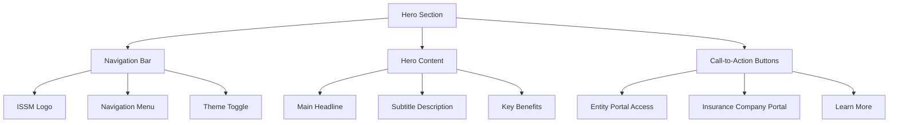
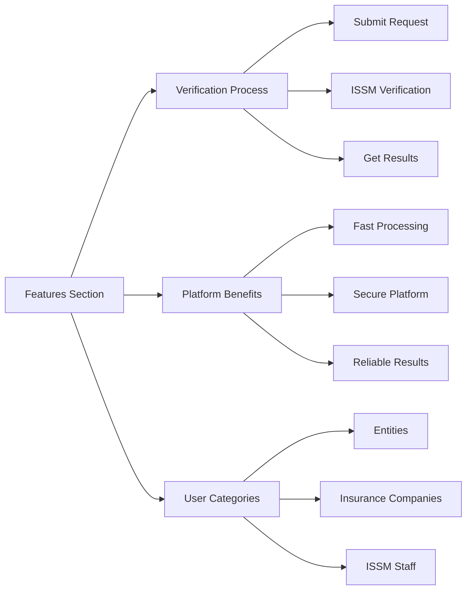
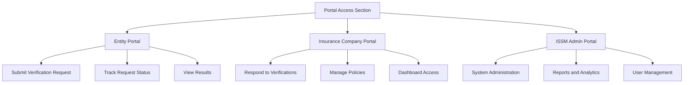
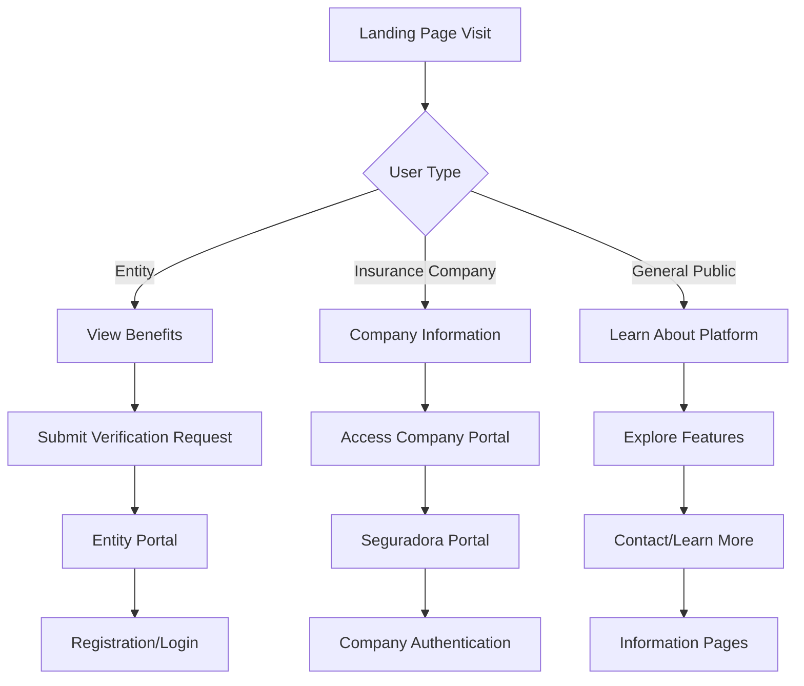

# ISSM Portal Landing Page Design

## Overview

The ISSM (Instituto de Supervisão de Seguros de Moçambique) Portal Landing Page serves as the primary entry point for entities seeking insurance policy verification services. This modern, dynamic landing page will showcase the platform's capabilities while providing clear pathways for different user types to access the portal's features.

**Core Purpose:**
- Introduce the ISSM insurance verification platform
- Guide entities to submit verification requests  
- Provide access to insurance companies (seguradoras) portal
- Display platform benefits and verification process
- Establish trust and credibility through professional design

## Technology Stack

**Frontend Framework:**
- HTML5 with semantic structure
- Bootstrap 5.x for responsive grid system
- Custom CSS with ISSM branding variables
- JavaScript ES6+ for interactive components

**Design System:**
- ISSM brand colors: Primary (#d78b29), Secondary (#2b6cb0)
- Iconify icons for modern iconography
- Custom CSS gradients and animations
- Mobile-first responsive design

**Dependencies:**
- Vendor CSS/JS (vendor.min.css, vendor.min.js)
- Icons CSS (icons.min.css)
- App CSS (app.min.css)
- ISSM Portal CSS (issm-portal.css)
- Theme configuration (config.js)

## Component Architecture

### Hero Section Component
The primary visual area that captures user attention and communicates the platform's value proposition.



**Key Elements:**
- Prominent ISSM logo and branding
- Clear value proposition headline
- Navigation menu with portal access links
- Responsive background with subtle animations
- Accessibility-compliant contrast ratios

### Features Section Component
Highlights the platform's core capabilities and benefits for different user types.



**Feature Cards:**
- Insurance policy verification workflow
- Platform security and reliability indicators
- Processing time and efficiency metrics
- Support and assistance information

### Portal Access Section Component
Provides clear pathways for different user types to access their respective portals.



**Portal Cards:**
- Entity portal with verification submission capabilities
- Insurance company portal for verification responses
- ISSM administrative portal for system management
- Visual indicators for each portal type

### Information Section Component
Provides educational content about the verification process and platform usage.

**Content Areas:**
- How the verification process works
- Required documentation and information
- Expected processing times
- Contact information and support
- Legal framework and compliance information

## Styling Strategy

### CSS Custom Properties
```css
:root {
    --issm-primary: #d78b29;
    --issm-secondary: #2b6cb0;
    --issm-accent: #3182ce;
    --issm-gradient: linear-gradient(135deg, #d78b29 0%, #d78b29 100%);
    --landing-hero-bg: linear-gradient(135deg, #f8fafc 0%, #e2e8f0 100%);
    --landing-section-padding: 4rem 0;
    --landing-card-radius: 16px;
    --landing-animation-duration: 0.6s;
}
```

### Component-Specific Styling
- **Hero Section:** Full-height viewport with gradient background
- **Feature Cards:** Hover animations with subtle shadows
- **Portal Access Cards:** Distinct visual styling for each user type
- **Navigation:** Sticky header with transparency effects
- **Typography:** Consistent heading hierarchy and readable fonts

### Responsive Design Breakpoints
- Mobile: 320px - 767px
- Tablet: 768px - 1023px  
- Desktop: 1024px - 1439px
- Large Desktop: 1440px+

### Animation and Interactions
- Smooth scroll navigation
- Fade-in animations on scroll
- Hover effects for interactive elements
- Loading states for portal access buttons
- Micro-interactions for enhanced user experience

## User Experience Flow

### Primary User Journeys



### Navigation Structure
- **Home:** Landing page with overview
- **Como Funciona:** Process explanation
- **Entidades:** Entity portal access
- **Seguradoras:** Insurance company portal access
- **Suporte:** Help and contact information
- **Sobre:** About ISSM and the platform

### Call-to-Action Strategy
- Primary CTA: "Verificar Apólice" (Verify Policy)
- Secondary CTA: "Portal Seguradoras" (Insurance Company Portal)
- Tertiary CTA: "Saiba Mais" (Learn More)

## Content Structure

### Headline Messaging
- **Primary:** "Verificação Rápida e Segura de Apólices de Seguro"
- **Secondary:** "Plataforma oficial do ISSM para verificação de autenticidade de apólices"
- **Supporting:** "Processo simplificado, resultados confiáveis, segurança garantida"

### Key Benefits
1. **Verificação Oficial:** Processo autorizado pelo ISSM
2. **Resultados Rápidos:** Verificação em tempo hábil
3. **Segurança:** Plataforma segura e protegida
4. **Acessibilidade:** Interface simples e intuitiva

### Process Steps
1. **Submeter Pedido:** Entity submits verification request
2. **Verificação ISSM:** ISSM verifies with insurance company
3. **Receber Resultado:** Entity receives verification result

## Technical Implementation

### File Structure
```
landing-page/
├── index.html (landing page)
├── assets/
│   ├── css/
│   │   ├── landing-page.css
│   │   └── issm-portal.css (existing)
│   ├── js/
│   │   ├── landing-page.js
│   │   └── components/ (existing)
│   └── images/
│       ├── hero-bg.jpg
│       ├── feature-icons/
│       └── portal-illustrations/
```

### JavaScript Components
- **HeroAnimation:** Manages hero section animations and interactions
- **FeatureCards:** Handles feature card hover effects and animations
- **PortalNavigation:** Manages navigation between different portals
- **ContactForm:** Handles contact/inquiry form submissions
- **ThemeManager:** Manages light/dark theme switching

### Performance Considerations
- Optimized images with WebP format support
- Lazy loading for below-the-fold content
- Minified CSS and JavaScript
- Progressive enhancement for animations
- Critical CSS inlined for faster initial render

### Accessibility Features
- WCAG 2.1 AA compliance
- Semantic HTML structure
- ARIA labels for interactive elements
- Keyboard navigation support
- High contrast color scheme options
- Screen reader optimized content

## Testing Strategy

### Cross-Browser Testing
- Chrome (latest 2 versions)
- Firefox (latest 2 versions)
- Safari (latest 2 versions)
- Edge (latest 2 versions)

### Device Testing
- Mobile devices (iOS and Android)
- Tablets (various screen sizes)
- Desktop computers (various resolutions)
- Large displays (4K and ultrawide)

### Performance Testing
- Page load speed optimization
- Animation performance on low-end devices
- Network condition testing (slow 3G, 4G, WiFi)
- Core Web Vitals compliance

### Usability Testing
- User task completion rates
- Navigation clarity and efficiency
- Call-to-action effectiveness
- Content comprehension and clarity