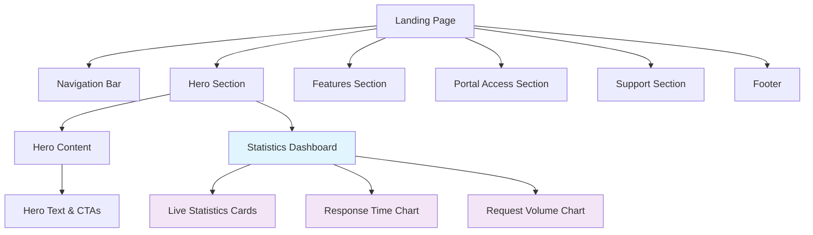
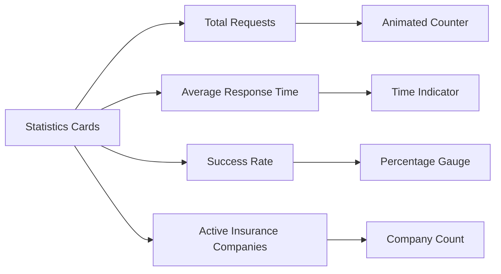
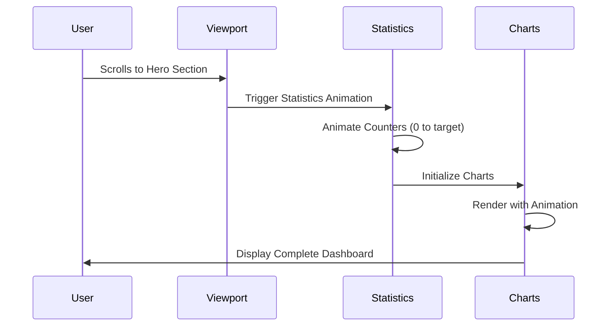
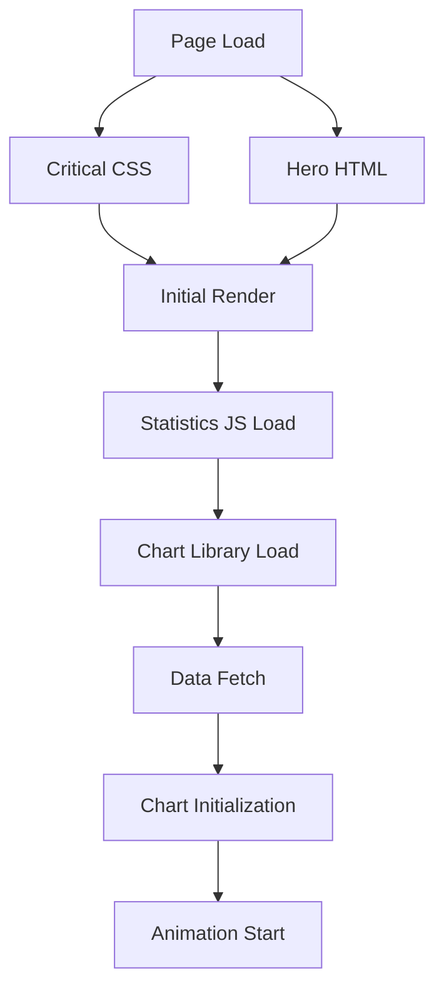

# Landing Page Enhancements Design

## Overview

This design document outlines comprehensive enhancements for the ISSM Portal landing page, focusing on improving visual appeal through better imagery, iconography, and user engagement by replacing the current verification form with a dynamic statistics dashboard showcasing general request statistics and response times.

## Technology Stack & Dependencies

### Current Stack
- **Frontend Framework**: Bootstrap 5.3+ with custom CSS
- **Icons**: Iconify library with Solar icon set
- **JavaScript**: Vanilla ES6+ with class-based architecture
- **CSS**: Custom CSS variables with theme support
- **Charts**: ApexCharts library (to be added for statistics)

### New Dependencies
- **ApexCharts**: For interactive statistics visualization
- **Intersection Observer API**: For scroll-triggered animations
- **CSS Custom Properties**: Enhanced variable system for dynamic theming

## Architecture

### Component Structure



### File Structure Enhancement

```
assets/
├── images/
│   ├── hero/
│   │   ├── verification-illustration.svg
│   │   ├── security-shield.svg
│   │   └── statistics-bg.svg
│   ├── icons/
│   │   ├── process-steps/
│   │   ├── features/
│   │   └── statistics/
│   └── backgrounds/
│       ├── hero-pattern.svg
│       └── section-dividers/
├── js/pages/
│   ├── landing-page.js (enhanced)
│   └── statistics-dashboard.js (new)
└── css/
    ├── landing-page.css (enhanced)
    └── statistics-dashboard.css (new)
```

## Hero Section Statistics Dashboard

### Current State Analysis
The current hero section includes a basic verification form that serves as a demo but doesn't provide real value to users visiting the landing page.

### Enhanced Statistics Dashboard Design

#### Dashboard Components

##### 1. Real-Time Statistics Cards



**Statistics Card Structure:**
- **Total Requests**: Monthly/yearly verification requests
- **Average Response Time**: "< 24h" with trending indicator
- **Success Rate**: Percentage with circular progress
- **Active Seguradoras**: Number of participating insurance companies

##### 2. Interactive Charts

**Request Volume Trend Chart:**
- **Type**: Line/Area chart showing monthly trends
- **Data Points**: Last 12 months of verification requests
- **Features**: Smooth animations, hover tooltips, responsive design

**Response Time Distribution:**
- **Type**: Radial progress chart
- **Categories**: < 2h, < 12h, < 24h, > 24h
- **Visual**: Color-coded segments with percentages

#### Implementation Structure

```javascript
class StatisticsDashboard {
    constructor() {
        this.apiEndpoint = '/api/v1/statistics';
        this.chartInstances = new Map();
        this.animationQueue = [];
    }

    async init() {
        await this.loadStatistics();
        this.initializeCharts();
        this.startRealTimeUpdates();
        this.initScrollAnimations();
    }

    async loadStatistics() {
        // Fetch real-time statistics data
        // Fallback to mock data for demo
    }

    initializeCharts() {
        this.createRequestVolumeChart();
        this.createResponseTimeChart();
        this.createSuccessRateGauge();
    }
}
```

### Visual Design Enhancements

#### Color Scheme & Branding
- **Primary Colors**: ISSM brand colors (maintaining existing variables)
- **Accent Colors**: Complementary blues and greens for statistics
- **Data Visualization**: Professional chart color palette

#### Typography Hierarchy
- **Statistics Numbers**: Large, bold display fonts
- **Labels**: Clear, readable secondary text
- **Descriptions**: Subtle, informative supporting text

#### Layout & Spacing
- **Grid System**: 4-column responsive layout for statistics cards
- **Chart Area**: Dedicated space with proper aspect ratios
- **Mobile Optimization**: Stacked layout with maintained readability

## Enhanced Visual Elements

### Iconography Strategy

#### Icon Categories & Implementation

##### 1. Statistics & Metrics Icons
```css
.statistics-icons {
    --icon-requests: "solar:document-text-bold-duotone";
    --icon-time: "solar:clock-circle-bold-duotone";
    --icon-success: "solar:check-circle-bold-duotone";
    --icon-companies: "solar:buildings-2-bold-duotone";
    --icon-trending-up: "solar:arrow-up-bold-duotone";
    --icon-trending-down: "solar:arrow-down-bold-duotone";
}
```

##### 2. Process & Feature Icons
- **Submit Request**: Document with plus icon
- **ISSM Verification**: Shield with checkmark
- **Receive Result**: Certificate with seal
- **Security**: Lock with key icon
- **Speed**: Lightning bolt or stopwatch
- **Reliability**: Star with ribbon
- **Accessibility**: Mobile device icon

##### 3. Interactive State Icons
- **Loading States**: Animated spinners
- **Success States**: Checkmarks with animations
- **Error States**: Warning triangles
- **Information**: Info circles with tooltips

### Image Integration Strategy

#### Hero Section Illustrations

##### 1. Main Verification Illustration
- **Style**: Modern, flat design with subtle gradients
- **Content**: Abstract representation of document verification
- **Colors**: ISSM brand colors with professional blue accents
- **Format**: SVG for scalability and performance

##### 2. Background Patterns
- **Geometric Patterns**: Subtle background textures
- **Brand Elements**: Integrated ISSM branding elements
- **Responsive Design**: Adaptable to different screen sizes

##### 3. Process Flow Illustrations
- **Step Visualizations**: Clear, simple icons for each process step
- **Flow Indicators**: Arrows and connecting elements
- **State Representations**: Visual feedback for different states

#### Implementation Structure

```css
.hero-visual-enhanced {
    position: relative;
    background: url('../images/hero/hero-pattern.svg') no-repeat center;
    background-size: cover;
}

.statistics-dashboard {
    background: linear-gradient(135deg, 
        rgba(255, 255, 255, 0.95) 0%, 
        rgba(248, 250, 252, 0.98) 100%);
    backdrop-filter: blur(10px);
    border-radius: 20px;
    box-shadow: var(--landing-shadow-xl);
}
```

## Statistics Data Structure

### API Integration Design

#### Data Models

```typescript
interface LandingStatistics {
    totalRequests: {
        current: number;
        previousPeriod: number;
        trend: 'up' | 'down' | 'stable';
    };
    averageResponseTime: {
        hours: number;
        minutes: number;
        trend: 'improving' | 'declining' | 'stable';
    };
    successRate: {
        percentage: number;
        breakdown: {
            approved: number;
            pending: number;
            rejected: number;
        };
    };
    activeInsurers: {
        count: number;
        recentlyJoined: string[];
    };
    monthlyTrends: {
        labels: string[];
        requests: number[];
        responseTime: number[];
    };
}
```

#### Mock Data Structure

```javascript
const mockStatistics = {
    totalRequests: {
        current: 3480,
        previousPeriod: 3120,
        trend: 'up'
    },
    averageResponseTime: {
        hours: 18,
        minutes: 30,
        trend: 'improving'
    },
    successRate: {
        percentage: 94.2,
        breakdown: {
            approved: 3276,
            pending: 156,
            rejected: 48
        }
    },
    activeInsurers: {
        count: 28,
        recentlyJoined: ['Seguradora Maputo', 'Hollard Moçambique']
    },
    monthlyTrends: {
        labels: ['Jan', 'Fev', 'Mar', 'Abr', 'Mai', 'Jun', 
                'Jul', 'Ago', 'Set', 'Out', 'Nov', 'Dez'],
        requests: [280, 310, 290, 340, 380, 360, 
                  420, 450, 440, 470, 485, 520],
        responseTime: [22, 20, 18, 19, 17, 16, 
                      15, 18, 17, 16, 14, 12]
    }
};
```

## Animation & Interaction Design

### Scroll-Triggered Animations

#### Animation Timeline



#### Animation Specifications

##### 1. Counter Animations
- **Duration**: 2 seconds with easing
- **Effect**: Count-up from 0 to target value
- **Stagger**: 200ms delay between each counter

##### 2. Chart Animations
- **Entry**: Fade in with scale effect
- **Data Points**: Sequential reveal with 100ms intervals
- **Hover States**: Smooth transitions with tooltips

##### 3. Progress Indicators
- **Circular Progress**: Animated stroke with percentage text
- **Bar Progress**: Fill animation with color transitions

### Interactive Elements

#### Hover Effects
- **Statistics Cards**: Subtle lift with shadow enhancement
- **Chart Elements**: Highlight with tooltip display
- **Call-to-Action Buttons**: Scale and shadow changes

#### Responsive Interactions
- **Touch Gestures**: Optimized for mobile interaction
- **Keyboard Navigation**: Full accessibility support
- **Screen Readers**: Proper ARIA labels and descriptions

## Performance Optimization

### Loading Strategy

#### Critical Path Optimization



#### Implementation Strategy

##### 1. Progressive Enhancement
- **Base Content**: Static statistics with basic styling
- **Enhanced Features**: Dynamic charts and animations load after core content
- **Fallback States**: Graceful degradation for older browsers

##### 2. Resource Loading
- **Critical CSS**: Inline essential styles
- **Deferred Loading**: Non-critical resources load after main content
- **Image Optimization**: WebP format with PNG fallbacks

##### 3. Caching Strategy
- **Statistics Data**: 5-minute cache for real-time feel
- **Static Assets**: Long-term caching for images and icons
- **Service Worker**: Offline capability for core functionality

### Accessibility Considerations

#### Screen Reader Support

```html
<div class="statistics-card" 
     role="img" 
     aria-label="Total verification requests: 3,480 with 12% increase from last month">
    <div class="stat-number" aria-hidden="true">3,480</div>
    <div class="stat-label" aria-hidden="true">Total Requests</div>
    <div class="stat-trend" aria-hidden="true">↗ 12%</div>
</div>
```

#### Keyboard Navigation
- **Tab Order**: Logical flow through interactive elements
- **Focus Indicators**: Clear visual feedback
- **Skip Links**: Direct navigation to main content sections

#### Color Accessibility
- **Contrast Ratios**: WCAG AA compliance (4.5:1 minimum)
- **Color Independence**: Information not conveyed by color alone
- **Dark Mode**: Full support with proper contrast maintenance

## Component Implementation

### Statistics Dashboard Component

```css
.statistics-dashboard {
    display: grid;
    grid-template-columns: repeat(auto-fit, minmax(250px, 1fr));
    gap: 1.5rem;
    margin-bottom: 3rem;
}

.statistics-card {
    background: white;
    border-radius: 16px;
    padding: 2rem;
    box-shadow: var(--landing-shadow-md);
    border: 1px solid rgba(255, 255, 255, 0.2);
    transition: all 0.3s ease;
}

.statistics-card:hover {
    transform: translateY(-4px);
    box-shadow: var(--landing-shadow-lg);
}

.stat-number {
    font-size: 2.5rem;
    font-weight: 800;
    color: var(--issm-primary);
    line-height: 1;
    margin-bottom: 0.5rem;
}

.stat-label {
    font-size: 0.875rem;
    font-weight: 600;
    color: #6b7280;
    text-transform: uppercase;
    letter-spacing: 0.05em;
    margin-bottom: 0.5rem;
}

.stat-trend {
    display: flex;
    align-items: center;
    font-size: 0.875rem;
    font-weight: 500;
}

.trend-up {
    color: #10b981;
}

.trend-down {
    color: #ef4444;
}

.trend-stable {
    color: #6b7280;
}
```

### Chart Container Styling

```css
.charts-container {
    display: grid;
    grid-template-columns: 1fr 1fr;
    gap: 2rem;
    margin-top: 2rem;
}

.chart-card {
    background: white;
    border-radius: 16px;
    padding: 1.5rem;
    box-shadow: var(--landing-shadow-sm);
    border: 1px solid #f3f4f6;
}

.chart-header {
    margin-bottom: 1rem;
}

.chart-title {
    font-size: 1.125rem;
    font-weight: 600;
    color: #1f2937;
    margin-bottom: 0.25rem;
}

.chart-subtitle {
    font-size: 0.875rem;
    color: #6b7280;
}

@media (max-width: 768px) {
    .charts-container {
        grid-template-columns: 1fr;
    }
    
    .statistics-dashboard {
        grid-template-columns: repeat(auto-fit, minmax(200px, 1fr));
        gap: 1rem;
    }
    
    .statistics-card {
        padding: 1.5rem;
    }
    
    .stat-number {
        font-size: 2rem;
    }
}
```

## Testing Strategy

### Visual Testing
- **Cross-Browser**: Chrome, Firefox, Safari, Edge compatibility
- **Responsive Design**: Mobile, tablet, desktop breakpoints
- **Accessibility**: Screen reader testing and keyboard navigation
- **Performance**: Core Web Vitals optimization

### Functional Testing
- **Chart Rendering**: Verify data visualization accuracy
- **Animation Performance**: Smooth transitions across devices
- **Data Loading**: Error handling and loading states
- **Theme Switching**: Dark/light mode compatibility

### User Experience Testing
- **Loading Speed**: Perceived performance optimization
- **Interaction Feedback**: Clear visual responses to user actions
- **Information Hierarchy**: Clear data presentation
- **Mobile Usability**: Touch-friendly interactions

This enhanced landing page design focuses on creating a more engaging and informative user experience by replacing the static verification form with dynamic statistics that showcase the ISSM Portal's activity and efficiency, while significantly improving the visual appeal through modern iconography and thoughtful imagery integration.