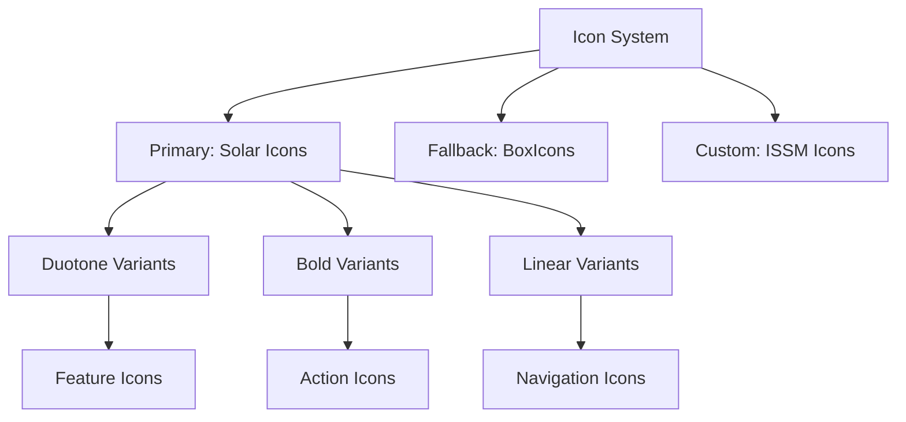
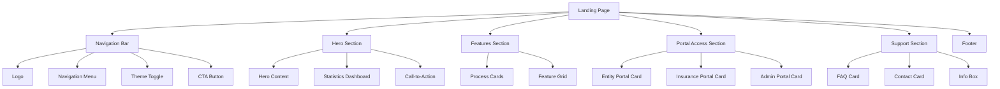
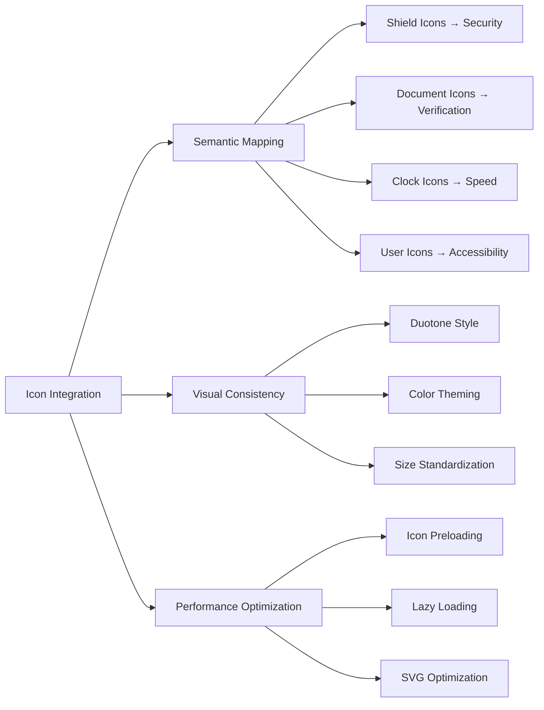
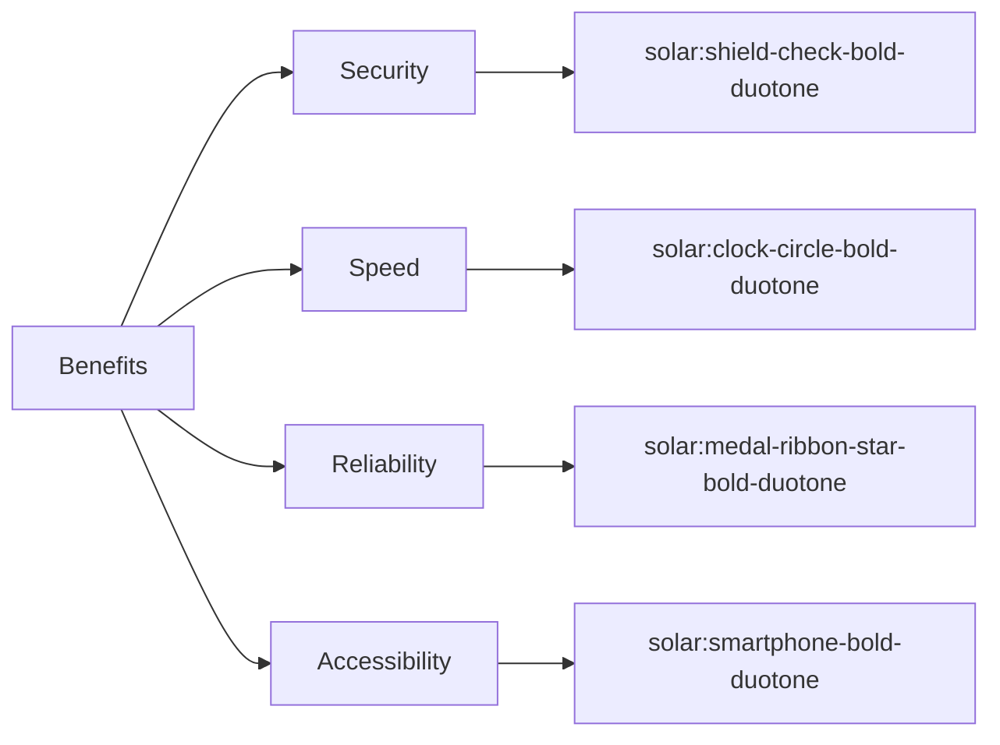
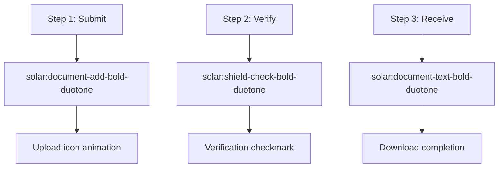
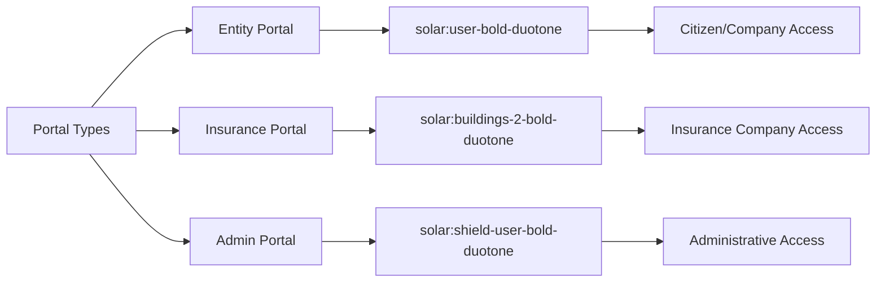
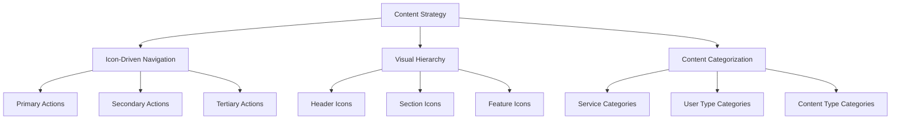
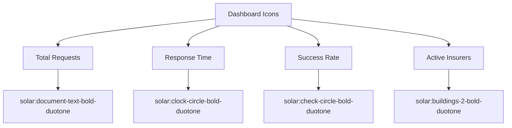
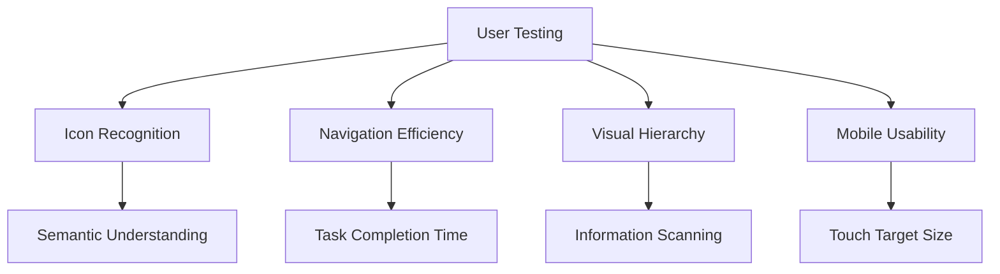

# ISSM Portal Landing Page Optimization Design

## Overview

This design document outlines comprehensive optimization strategies for the ISSM Portal landing page, focusing on enhanced user experience, icon library integration, visual improvements, and performance enhancements. The optimization builds upon the existing implementation to create a world-class government portal landing page.

## Technology Stack & Dependencies

### Current Stack
- **Framework**: Bootstrap 5 with custom ISSM styling
- **Icons**: Iconify with Solar icon set (primary)
- **Charts**: ApexCharts for statistics visualization
- **JavaScript**: ES6+ modular architecture
- **CSS**: Modern CSS3 with custom properties

### Icon System Architecture


## Architecture

### Component Hierarchy


### Icon Integration Strategy


## Landing Page Enhancements

### 1. Navigation Bar Optimization

#### Icon Integration
- **Menu Toggle**: `solar:hamburger-menu-broken` (existing)
- **Theme Toggle**: `solar:moon-bold-duotone` / `solar:sun-bold-duotone`
- **Search Icon**: `solar:magnifer-bold-duotone`
- **Notification Bell**: `solar:bell-bing-bold-duotone`
- **User Profile**: `solar:user-circle-bold-duotone`

#### Enhanced Features
- **Sticky Navigation**: Enhanced scroll behavior with blur backdrop
- **Search Integration**: Quick search functionality with icon
- **Breadcrumb Navigation**: For deeper pages with arrow icons
- **Language Switcher**: Multi-language support with globe icon

### 2. Hero Section Enhancements

#### Icon-Driven Benefits


#### Visual Improvements
- **Animated Icons**: Subtle hover animations for benefit icons
- **Progress Indicators**: Step-by-step verification process with icons
- **Trust Badges**: Government certification badges with shield icons
- **Performance Metrics**: Real-time statistics with chart icons

### 3. Features Section (Como Funciona)

#### Process Step Icons


#### Feature Grid Enhancement
- **Security Features**: Lock and shield iconography
- **Speed Features**: Lightning and clock icons
- **Reliability Features**: Star and medal icons
- **Accessibility Features**: Universal access icons

### 4. Portal Access Section

#### Portal Identification Icons


#### Enhanced Portal Cards
- **Feature Lists**: Icon-prefixed feature descriptions
- **Access Indicators**: Status icons showing portal availability
- **User Type Icons**: Clear visual identification
- **Action Buttons**: Enhanced with appropriate icons

### 5. Support Section Enhancement

#### Support Type Icons
- **FAQ**: `solar:question-circle-bold-duotone`
- **Contact**: `solar:phone-bold-duotone`
- **Documentation**: `solar:document-text-bold-duotone`
- **Help Center**: `solar:help-circle-bold-duotone`

#### Information Architecture
- **Contact Methods**: Phone, email, and chat icons
- **Help Categories**: Categorized with relevant icons
- **Status Indicators**: Available/unavailable service icons

## Visual Design System

### Icon Design Principles

#### Consistency Standards
- **Style**: Solar Duotone for primary actions, Bold for secondary
- **Size**: 16px (small), 20px (medium), 24px (large), 32px (extra-large)
- **Color**: Theme-aware coloring with ISSM brand colors
- **Spacing**: 8px minimum spacing around icons

#### Icon Categories
``mermaid
mindmap
  root)Icon Categories(
    Navigation
      Menu
      Arrows
      Breadcrumbs
    Actions
      Submit
      Download
      Share
      Edit
    Status
      Success
      Warning
      Error
      Loading
    Features
      Security
      Speed
      Reliability
      Accessibility
    Content
      Documents
      Images
      Data
      Reports
```

### Color System Integration

#### Icon Color Mapping
- **Primary Actions**: `#d78b29` (ISSM Orange)
- **Secondary Actions**: `#2b6cb0` (ISSM Blue)
- **Success States**: `#059669` (Green)
- **Warning States**: `#d97706` (Amber)
- **Error States**: `#dc2626` (Red)
- **Neutral States**: `#6b7280` (Gray)

### Animation Framework

#### Icon Animations
``mermaid
graph TD
    A[Animation Types] --> B[Hover Effects]
    A --> C[Loading States]
    A --> D[State Transitions]
    A --> E[Scroll Triggers]
    
    B --> F[Scale Transform]
    B --> G[Color Transition]
    B --> H[Rotation Effect]
    
    C --> I[Spin Animation]
    C --> J[Pulse Effect]
    C --> K[Progress Bars]
    
    D --> L[Success Checkmark]
    D --> M[Error Shake]
    D --> N[Warning Flash]
    
    E --> O[Fade In]
    E --> P[Slide Up]
    E --> Q[Stagger Effect]
```

## User Experience Enhancements

### 1. Navigation Improvements

#### Enhanced Search Functionality
- **Global Search**: Site-wide search with magnifying glass icon
- **Quick Actions**: Dropdown with frequently used actions
- **Keyboard Shortcuts**: Accessible shortcuts with key icons
- **Search Suggestions**: Auto-complete with relevant icons

#### Improved Mobile Navigation
- **Hamburger Menu**: Enhanced with smooth animation
- **Touch Gestures**: Swipe navigation with arrow icons
- **Quick Access**: Floating action button with plus icon
- **Breadcrumb Trail**: Mobile-optimized with arrow icons

### 2. Content Discoverability

#### Information Architecture


#### Enhanced Card Design
- **Icon Headers**: Prominent icons for each card type
- **Status Indicators**: Visual status with colored icons
- **Progress Tracking**: Step indicators with check icons
- **Call-to-Action**: Enhanced buttons with action icons

### 3. Accessibility Improvements

#### Icon Accessibility
- **Alt Text**: Comprehensive alternative text for all icons
- **ARIA Labels**: Proper labeling for screen readers
- **High Contrast**: Enhanced contrast modes
- **Keyboard Navigation**: Full keyboard accessibility

#### Universal Design
- **Color Independence**: Information not solely conveyed by color
- **Size Flexibility**: Scalable icons for vision impairments
- **Motion Sensitivity**: Respect for reduced motion preferences
- **Language Independence**: Universal icon meanings

## Performance Optimization

### Icon Loading Strategy

#### Optimization Techniques
``mermaid
graph LR
    A[Icon Optimization] --> B[SVG Sprites]
    A --> C[Icon Fonts]
    A --> D[Lazy Loading]
    A --> E[CDN Delivery]
    
    B --> F[Single HTTP Request]
    C --> G[Browser Caching]
    D --> H[Viewport-Based Loading]
    E --> I[Global Edge Caching]
```

#### Loading Performance
- **Critical Icons**: Inline SVGs for above-the-fold content
- **Secondary Icons**: Lazy-loaded icon sprites
- **Fallback System**: Progressive enhancement approach
- **Caching Strategy**: Aggressive caching for icon assets

### Asset Management

#### File Organization
```
assets/
├── icons/
│   ├── sprites/
│   │   ├── primary-icons.svg
│   │   ├── secondary-icons.svg
│   │   └── navigation-icons.svg
│   ├── fonts/
│   │   ├── solar-icons.woff2
│   │   └── boxicons.woff2
│   └── individual/
│       ├── logo.svg
│       └── badges/
├── css/
│   ├── icons.min.css
│   └── icon-animations.css
└── js/
    ├── icon-loader.js
    └── animation-controller.js
```

## Enhanced Statistics Dashboard

### Dashboard Icon Integration

#### Metric Visualization Icons


#### Interactive Elements
- **Chart Icons**: Interactive chart type selectors
- **Filter Icons**: Data filtering with funnel icons
- **Export Icons**: Download options with save icons
- **Refresh Icons**: Manual refresh with circular arrow

### Real-time Features

#### Status Indicators
- **System Status**: Online/offline indicators with colored dots
- **Update Status**: Last updated timestamp with clock icon
- **Data Freshness**: Real-time indicators with pulse animation
- **Alert Status**: Important notifications with bell icons

## Testing Strategy

### Icon Testing Framework

#### Visual Testing
- **Icon Rendering**: Cross-browser icon display testing
- **Animation Testing**: Smooth animation across devices
- **Accessibility Testing**: Screen reader compatibility
- **Performance Testing**: Loading time measurements

#### User Testing


### Quality Assurance

#### Testing Checklist
- **Icon Consistency**: Visual style alignment
- **Functional Testing**: Icon interactions work correctly
- **Responsive Testing**: Icons scale appropriately
- **Performance Testing**: No degradation in loading times
- **Accessibility Testing**: Full compliance with WCAG guidelines

## Implementation Roadmap

### Phase 1: Core Icon Integration (Week 1-2)
- Replace existing icons with Solar icon set
- Implement icon animation framework
- Enhance navigation with new icons
- Update hero section icons

### Phase 2: Enhanced Features (Week 3-4)
- Implement search functionality
- Enhanced portal cards with icons
- Statistics dashboard improvements
- Mobile navigation enhancements

### Phase 3: Performance & Accessibility (Week 5-6)
- Icon loading optimization
- Accessibility compliance testing
- Performance monitoring setup
- Cross-browser testing

### Phase 4: Advanced Features (Week 7-8)
- Interactive dashboard elements
- Advanced animations
- User preference settings
- Analytics integration

## Maintenance & Evolution

### Icon Library Management
- **Version Control**: Track icon library updates
- **Consistency Checks**: Regular icon usage audits
- **Performance Monitoring**: Track icon loading metrics
- **User Feedback**: Collect icon usability feedback

### Future Enhancements
- **Custom Icon Development**: ISSM-specific icons
- **Animation Library**: Expanded animation options
- **Personalization**: User-customizable icon preferences
- **Internationalization**: Culture-specific icon adaptations
