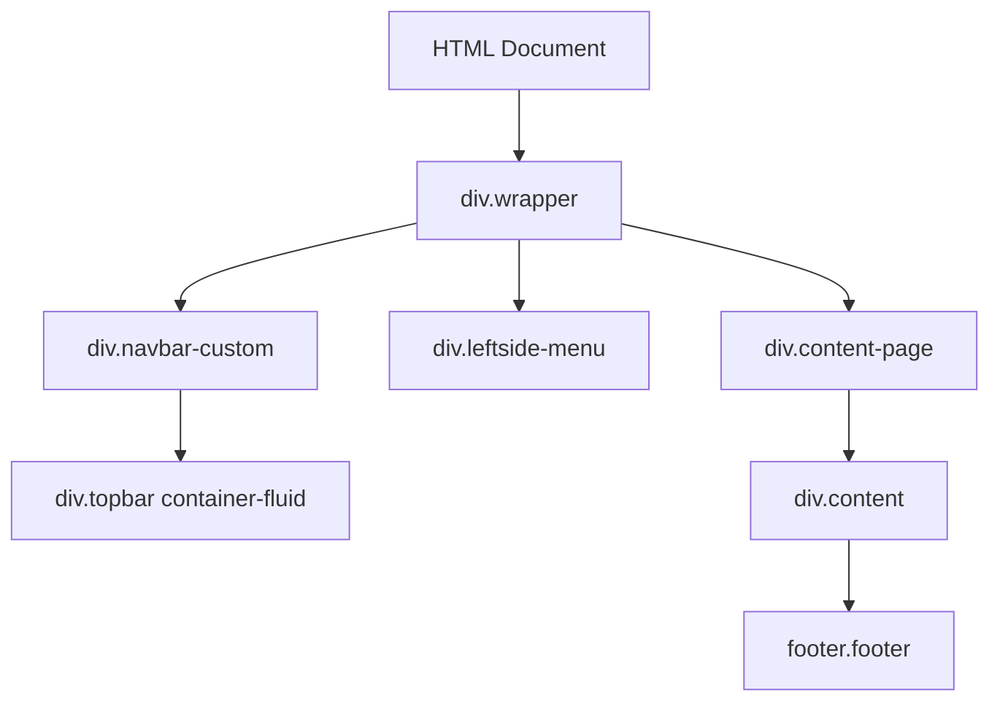
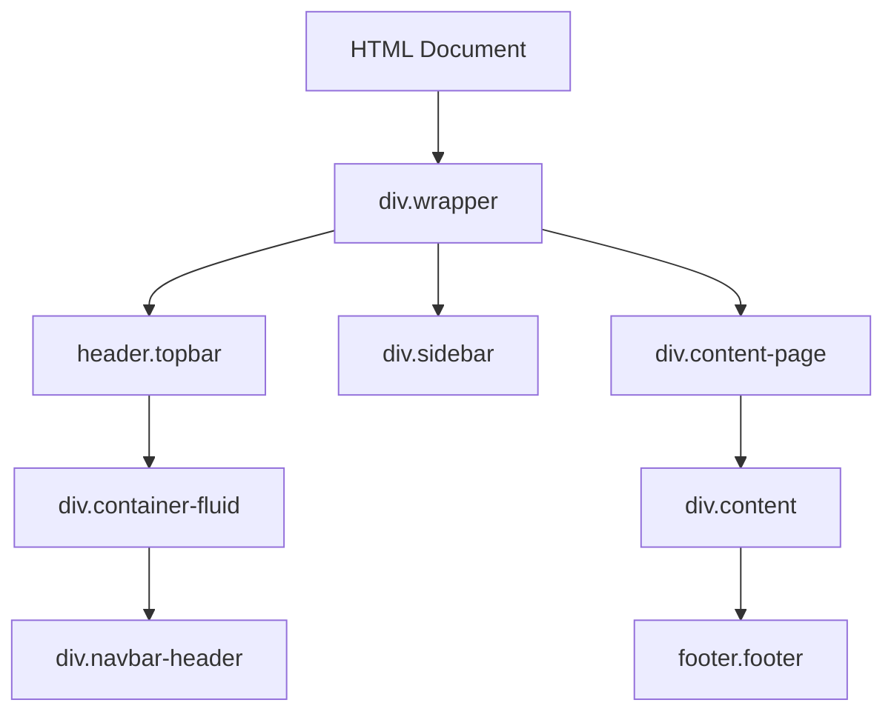

# Layout Fix Design - ISSM Portal das Entidades

## Overview
This design addresses the layout inconsistencies in three HTML files within the ISSM Portal das Entidades system where the sidebar, header, and footer structures are broken compared to the base template.

## Problem Analysis

### Affected Files
- `entidades/verificacao-detalhes.html`
- `entidades/perfil-entidade.html` 
- `entidades/verificacao-editar.html`

### Issues Identified
1. **Inconsistent Header Structure**: Using `navbar-custom` instead of standard `topbar` header
2. **Sidebar Implementation**: Using `leftside-menu` instead of proper sidebar structure
3. **Missing CSS Dependencies**: Incomplete vendor CSS references
4. **Layout Container Issues**: Improper wrapper and content-page structure

## Architecture Analysis

### Current Broken Structure


### Target Correct Structure  


## Template Structure Components

### Header Component Requirements
- Use `<header class="topbar">` instead of `<div class="navbar-custom">`
- Implement proper `navbar-header` structure
- Include correct topbar items and navigation
- Maintain theme toggle and user dropdown functionality

### Sidebar Component Requirements
- Replace `leftside-menu` with standard sidebar structure
- Ensure proper navigation menu hierarchy
- Maintain active state management
- Include all necessary navigation items for entities portal

### Footer Component Requirements
- Consistent footer placement within content structure
- Proper ISSM branding and copyright information
- Responsive design maintenance

## CSS Dependencies Fix

### Required Vendor CSS Files
```html
<link href="../assets/css/vendor.min.css" rel="stylesheet" type="text/css" />
<link href="../assets/css/icons.min.css" rel="stylesheet" type="text/css" />
<link href="../assets/css/app.min.css" rel="stylesheet" type="text/css" />
<link href="../assets/css/issm-portal.css" rel="stylesheet" type="text/css" />
```

### JavaScript Dependencies
```html
<script src="../assets/js/vendor.js"></script>
<script src="../assets/js/app.js"></script>
```

## Layout Implementation Strategy

### Header Structure Implementation
The header should follow the pattern from the working template:
- Container fluid with navbar-header
- Left side: menu toggle button and portal title
- Right side: theme toggle, notifications, and user profile dropdown

### Sidebar Navigation Structure
Implement standardized sidebar with:
- Portal das Entidades branding
- Dashboard link
- Verificações section with submenu
- Configuration section
- Proper active state handling

### Content Area Structure
Maintain responsive content structure:
- Proper page title and breadcrumb implementation
- Consistent card-based content layout
- Responsive grid system usage

## Component Mapping

### verificacao-detalhes.html Components
| Current Component | Target Component | Changes Required |
|-------------------|------------------|------------------|
| navbar-custom | topbar header | Replace div with header tag |
| leftside-menu | sidebar | Update class and structure |
| content-page | content-page | Maintain current structure |
| Document viewer modal | Document viewer modal | Keep existing functionality |

### perfil-entidade.html Components  
| Current Component | Target Component | Changes Required |
|-------------------|------------------|------------------|
| navbar-custom | topbar header | Replace div with header tag |
| leftside-menu | sidebar | Update class and structure |
| Profile forms | Profile forms | Maintain current functionality |
| Action cards | Action cards | Keep existing layout |

### verificacao-editar.html Components
| Current Component | Target Component | Changes Required |
|-------------------|------------------|------------------|
| navbar-custom | topbar header | Replace div with header tag |
| leftside-menu | sidebar | Update class and structure |
| Edit forms | Edit forms | Maintain current functionality |
| Preview modal | Preview modal | Keep existing functionality |

## Responsive Design Considerations

### Mobile Layout
- Ensure proper menu toggle functionality
- Maintain responsive sidebar collapse
- Preserve touch-friendly navigation

### Tablet Layout  
- Optimize sidebar width for tablet screens
- Ensure content readability
- Maintain proper spacing and typography

### Desktop Layout
- Full sidebar visibility
- Proper content area utilization
- Consistent header height and spacing

## JavaScript Integration

### Required JavaScript Functionality
- Menu toggle and sidebar management
- Theme switching capability
- Bootstrap component initialization
- Form validation and submission
- Modal management

### Page-Specific Scripts
- verification-details.js for document viewer
- entity-profile.js for profile management
- verification-edit.js for form editing

## Testing Strategy

### Layout Validation
- Cross-browser compatibility testing
- Responsive design verification
- Navigation functionality testing
- Component interaction validation

### Accessibility Testing
- Keyboard navigation support
- Screen reader compatibility
- Color contrast validation
- ARIA attribute implementation

## Implementation Priority

### Phase 1: Critical Layout Structure
1. Fix header structure in all three files
2. Standardize sidebar implementation
3. Ensure proper CSS/JS dependencies

### Phase 2: Functionality Validation
1. Test navigation functionality
2. Validate form submissions
3. Verify modal operations

### Phase 3: Responsive Testing
1. Mobile layout verification
2. Tablet layout optimization
3. Desktop layout consistency

## Success Criteria

### Layout Consistency
- All three files match the base template structure
- Sidebar, header, and footer are intact and functional
- Navigation works consistently across all pages

### Visual Consistency
- Consistent branding and styling
- Proper spacing and typography
- Responsive behavior matches other portal pages

### Functional Integrity
- All existing functionality preserved
- Forms continue to work properly
- Modals and interactive elements function correctly