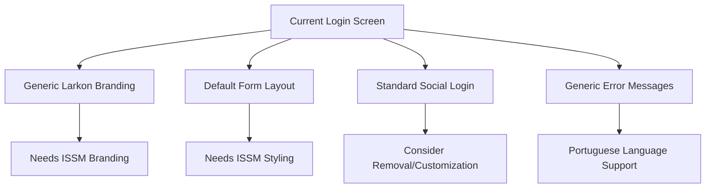
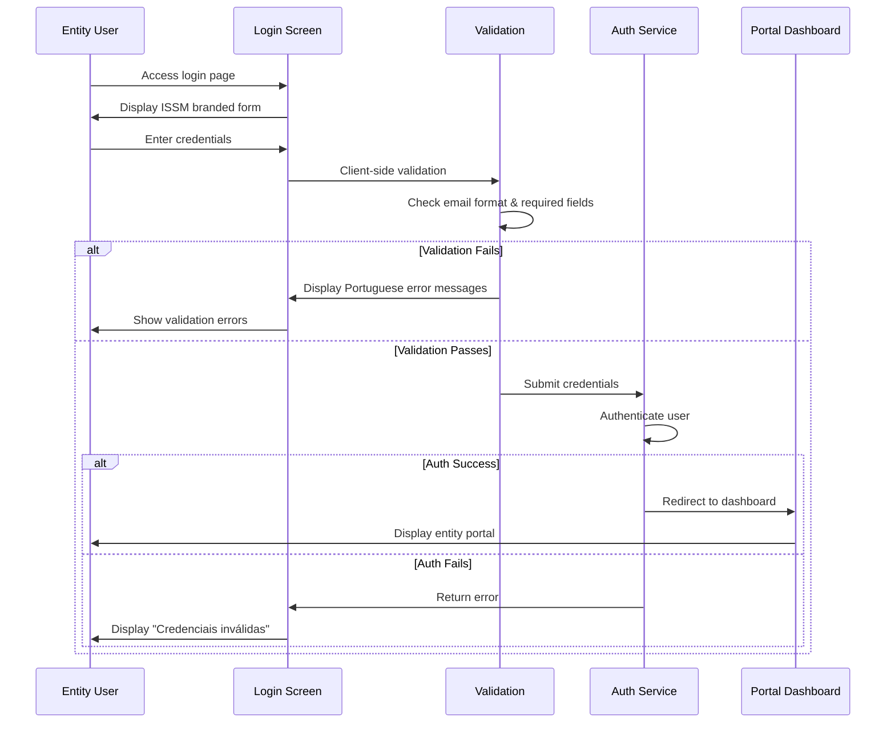
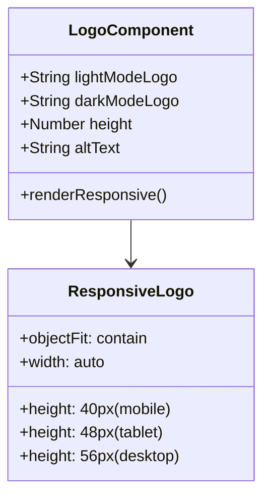
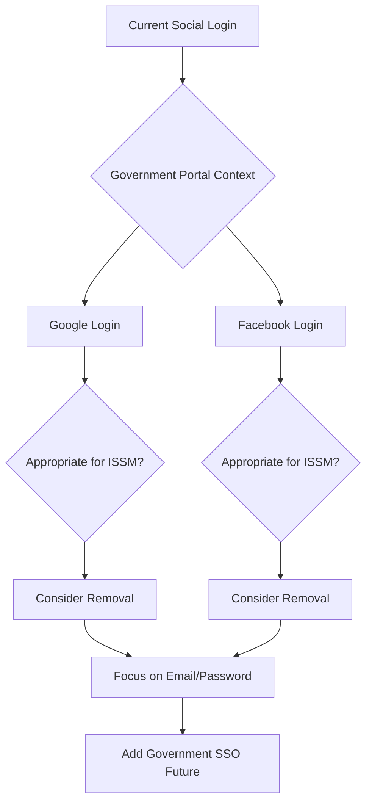

# Login Screen Adjustment for ISSM Entity Portal

## Overview

This document outlines the design adjustments needed for the authentication login screen (`entidades/auth-signin.html`) to align with the ISSM (Instituto de Supervisão de Seguros de Moçambique) platform branding and context. The current login screen uses generic Larkon template branding and needs to be customized for the ISSM Entity Portal.

## Technology Stack

- **Frontend Framework**: Bootstrap 5.x with custom ISSM styling
- **Icons**: Iconify Solar icons for consistency with portal design
- **Styling**: Custom CSS with ISSM branding variables
- **JavaScript**: Vanilla JS with form validation

## Current State Analysis



### Issues Identified
- Title shows "Larkon - Responsive Admin Dashboard Template"
- Generic logo placeholders (logo-dark.png, logo-light.png)
- English language interface (should be Portuguese)
- Generic welcome messages
- Social login options may not be appropriate for government portal
- Missing ISSM-specific styling and colors

## Design Requirements

### Branding Requirements
- **Platform Name**: "Portal de Verificação de Apólices - ISSM"
- **Organization**: Instituto de Supervisão de Seguros de Moçambique
- **Color Scheme**: ISSM brand colors (primary: #d78b29, secondary: #2b6cb0)
- **Language**: Portuguese (pt-PT)
- **Logo**: ISSM official logo with proper responsive sizing

### Content Localization
| Current (English) | Target (Portuguese) |
|-------------------|-------------------|
| Sign In | Entrar |
| Enter your email address and password to access admin panel | Insira o seu email e palavra-passe para aceder ao portal |
| Email | Email |
| Password | Palavra-passe |
| Remember me | Lembrar-me |
| Reset password | Recuperar palavra-passe |
| Don't have an account? | Não tem conta? |
| Sign Up | Registar |

## Authentication Flow Architecture



## Component Structure

### Header Metadata
```html
<title>Entrar | ISSM - Instituto de Supervisão de Seguros de Moçambique</title>
<meta name="description" content="Portal de verificação de apólices - Sistema de autenticação para entidades" />
<meta name="author" content="ISSM" />
```

### Logo Implementation


### Form Structure Enhancement
```html
<!-- Enhanced Form Layout -->
<form class="authentication-form issm-auth-form">
    <div class="mb-3">
        <label class="form-label" for="issm-email">Email</label>
        <input type="email" 
               id="issm-email" 
               name="email" 
               class="form-control issm-input" 
               placeholder="Insira o seu email"
               required>
        <div class="invalid-feedback">Por favor, insira um email válido</div>
    </div>
    
    <div class="mb-3">
        <div class="d-flex justify-content-between align-items-center mb-2">
            <label class="form-label" for="issm-password">Palavra-passe</label>
            <a href="auth-password.html" class="text-muted text-decoration-none">
                Esqueceu a palavra-passe?
            </a>
        </div>
        <input type="password" 
               id="issm-password" 
               name="password"
               class="form-control issm-input" 
               placeholder="Insira a sua palavra-passe"
               required>
        <div class="invalid-feedback">Por favor, insira a sua palavra-passe</div>
    </div>
</form>
```

## Styling Adjustments

### ISSM Brand Colors Integration
```css
.issm-auth-form {
    --auth-primary: var(--issm-primary, #d78b29);
    --auth-secondary: var(--issm-secondary, #2b6cb0);
    --auth-accent: var(--issm-accent, #3182ce);
}

.issm-input:focus {
    border-color: var(--auth-primary);
    box-shadow: 0 0 0 0.2rem rgba(215, 139, 41, 0.25);
}

.btn-issm-primary {
    background: linear-gradient(135deg, var(--auth-primary) 0%, var(--auth-secondary) 100%);
    border: none;
    color: white;
    font-weight: 600;
    padding: 0.75rem 2rem;
    border-radius: 8px;
    transition: all 0.3s ease;
}
```

### Responsive Logo Implementation
```css
.issm-logo-container {
    height: 48px;
    display: flex;
    align-items: center;
    margin-bottom: 2rem;
}

.issm-logo {
    max-height: 100%;
    width: auto;
    object-fit: contain;
}

@media (min-width: 768px) {
    .issm-logo-container {
        height: 56px;
    }
}

@media (min-width: 1200px) {
    .issm-logo-container {
        height: 64px;
    }
}
```

## Form Validation Enhancement

### Client-Side Validation Rules
```javascript
const IssmAuthValidator = {
    emailPattern: /^[a-zA-Z0-9._%+-]+@[a-zA-Z0-9.-]+\.[a-zA-Z]{2,}$/,
    
    validateEmail(email) {
        if (!email.trim()) {
            return { valid: false, message: 'O email é obrigatório' };
        }
        if (!this.emailPattern.test(email)) {
            return { valid: false, message: 'Por favor, insira um email válido' };
        }
        return { valid: true };
    },
    
    validatePassword(password) {
        if (!password.trim()) {
            return { valid: false, message: 'A palavra-passe é obrigatória' };
        }
        if (password.length < 6) {
            return { valid: false, message: 'A palavra-passe deve ter pelo menos 6 caracteres' };
        }
        return { valid: true };
    }
};
```

## Security Considerations

### Authentication Security
- HTTPS enforcement for all authentication requests
- CSRF protection implementation
- Session management with secure tokens
- Rate limiting for login attempts
- Account lockout after multiple failed attempts

### Data Protection
- Email masking in error logs
- Secure password transmission
- Session timeout configuration
- Remember me token security

## Social Login Assessment



### Recommendation
- Remove social login options initially
- Focus on secure email/password authentication
- Consider future integration with government SSO systems
- Maintain clean, professional appearance

## Error Handling

### Portuguese Error Messages
| Error Type | Portuguese Message |
|------------|-------------------|
| Empty email | O email é obrigatório |
| Invalid email format | Por favor, insira um email válido |
| Empty password | A palavra-passe é obrigatória |
| Authentication failed | Credenciais inválidas. Verifique o seu email e palavra-passe |
| Account locked | Conta temporariamente bloqueada. Tente novamente em alguns minutos |
| Server error | Erro do servidor. Tente novamente mais tarde |

## Accessibility Compliance

### WCAG 2.1 AA Standards
- Proper heading structure (h1, h2 hierarchy)
- Form labels associated with inputs
- Sufficient color contrast ratios
- Keyboard navigation support
- Screen reader compatibility
- Focus indicators for all interactive elements

### Implementation
```html
<form class="authentication-form" role="form" aria-label="Formulário de autenticação ISSM">
    <div class="mb-3">
        <label class="form-label" for="issm-email" id="email-label">
            Email <span class="text-danger" aria-label="obrigatório">*</span>
        </label>
        <input type="email" 
               id="issm-email" 
               name="email" 
               class="form-control" 
               placeholder="Insira o seu email"
               aria-describedby="email-help email-error"
               aria-required="true"
               required>
        <div id="email-error" class="invalid-feedback" role="alert"></div>
    </div>
</form>
```

## Implementation Phases

### Phase 1: Content Localization
1. Update page title and meta information
2. Translate all text content to Portuguese
3. Update form labels and placeholders
4. Implement Portuguese error messages

### Phase 2: Visual Branding
1. Replace logo with ISSM official logo
2. Apply ISSM color scheme
3. Update CSS classes with ISSM styling
4. Implement responsive logo sizing

### Phase 3: Form Enhancement
1. Add client-side validation with Portuguese messages
2. Implement proper ARIA labels
3. Add form submission handling
4. Remove or customize social login options

### Phase 4: Security & Testing
1. Implement CSRF protection
2. Add rate limiting
3. Test accessibility compliance
4. Perform security audit

## Testing Strategy

### Unit Testing
- Form validation functions
- Error message display
- Responsive logo behavior
- Color theme application

### Integration Testing
- Authentication flow end-to-end
- Error handling scenarios
- Session management
- Redirect functionality

### Accessibility Testing
- Screen reader compatibility
- Keyboard navigation
- Color contrast validation
- Focus management

### Browser Compatibility
- Modern browsers (Chrome, Firefox, Safari, Edge)
- Mobile responsiveness
- Touch interface support
- Print stylesheet consideration