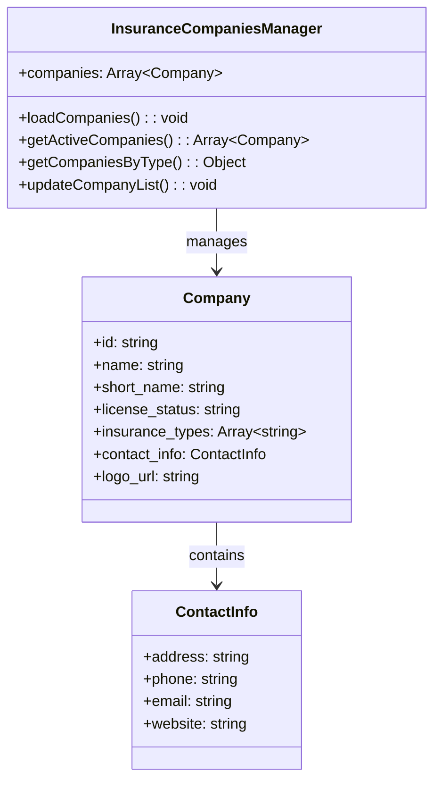
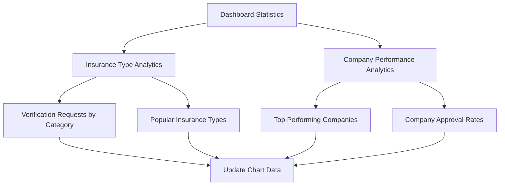
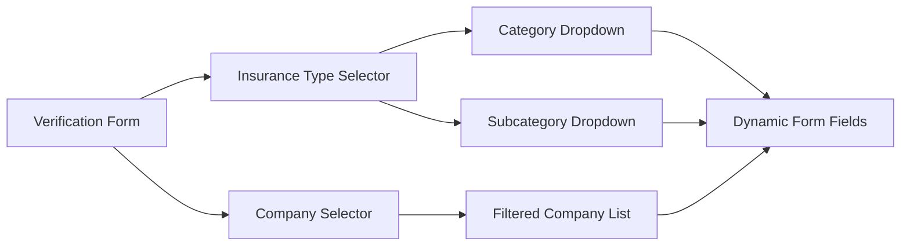
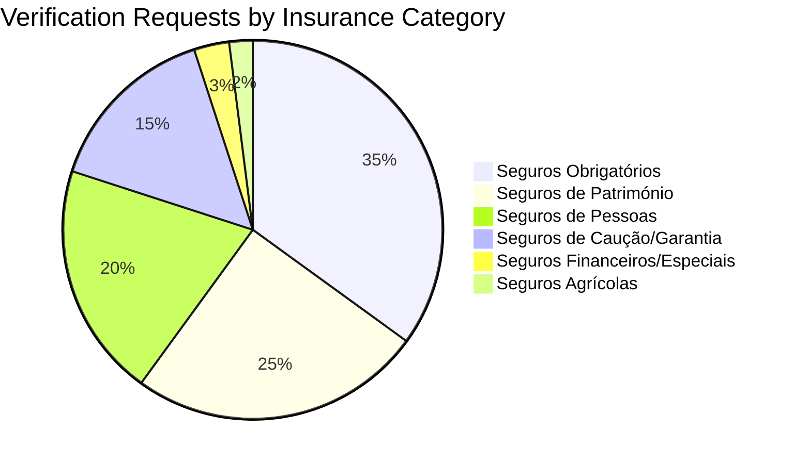

# ISSM Entity Dashboard Insurance Types and Companies Integration Design

## Overview

This design document outlines the enhancement of the ISSM Entity Dashboard to accurately display and integrate the correct insurance types and companies information for the Mozambican insurance market. The update involves implementing proper categorization of insurance products and maintaining an accurate list of licensed insurance companies operating in Mozambique.

## Technology Stack

- **Frontend Framework**: Bootstrap 5 with custom ISSM portal styling
- **JavaScript**: Vanilla ES6+ with ApexCharts for data visualization
- **CSS Framework**: Custom ISSM portal CSS with responsive design
- **Backend Integration**: API endpoints for insurance data management
- **Data Format**: JSON structures for insurance types and companies

## Component Architecture

### Insurance Types Data Structure

```mermaid
classDiagram
class InsuranceTypes {
+surety_guarantee: SuretyInsurance
+mandatory: MandatoryInsurance
+personal: PersonalInsurance
+property: PropertyInsurance
+agricultural: AgriculturalInsurance
+financial_special: FinancialSpecialInsurance
}

class SuretyInsurance {
+provisional_guarantee: string
+definitive_guarantee: string
+advance_payment: string
+good_execution: string
+payment_retention: string
}

class MandatoryInsurance {
+automobile_liability: string
+work_accidents: string
+carrier_liability: string
+construction_assembly: string
}

class PersonalInsurance {
+life_insurance: string
+health_insurance: string
+personal_accidents: string
+education_insurance: string
+funeral_insurance: string
}

class PropertyInsurance {
+multi_risk: string
+fire_lightning_explosion: string
+floods_storms_cyclones: string
+industrial_risks: string
+electronic_equipment: string
+cargo_transport: string
+machinery_breakdown: string
}

class AgriculturalInsurance {
+crop_insurance: string
+livestock_insurance: string
}

class FinancialSpecialInsurance {
+credit_insurance: string
+political_risks: string
+professional_liability: string
+travel_insurance: string
}
```



### Insurance Companies Data Management



## Data Models & Mapping

### Insurance Categories Structure

```javascript
const insuranceCategories = {
  surety_guarantee: {
    id: 'surety_guarantee',
    name: 'Seguros de Caução / Garantia',
    types: [
      {
        id: 'provisional_guarantee',
        name: 'Garantia Provisória (concursos públicos)',
        description: 'Garantia para participação em concursos públicos'
      },
      {
        id: 'definitive_guarantee', 
        name: 'Garantia Definitiva (execução de contrato)',
        description: 'Garantia para execução de contratos adjudicados'
      },
      {
        id: 'advance_payment',
        name: 'Adiantamento de Pagamento',
        description: 'Garantia de devolução de adiantamentos'
      },
      {
        id: 'good_execution',
        name: 'Boa Execução',
        description: 'Garantia de boa execução de contratos'
      },
      {
        id: 'payment_retention',
        name: 'Retenção de Pagamento',
        description: 'Garantia substitutiva de retenção'
      }
    ]
  },
  mandatory: {
    id: 'mandatory',
    name: 'Seguros Obrigatórios',
    types: [
      {
        id: 'automobile_liability',
        name: 'Automóvel (Responsabilidade Civil – terceiros)',
        description: 'Seguro obrigatório de responsabilidade civil automóvel'
      },
      {
        id: 'work_accidents',
        name: 'Acidentes de Trabalho',
        description: 'Seguro obrigatório de acidentes de trabalho'
      },
      {
        id: 'carrier_liability',
        name: 'Responsabilidade Civil para Transportadores',
        description: 'Seguro obrigatório para empresas de transporte'
      },
      {
        id: 'construction_assembly',
        name: 'Construção e Montagem (em certas obras)',
        description: 'Seguro obrigatório para determinadas obras'
      }
    ]
  },
  personal: {
    id: 'personal',
    name: 'Seguros de Pessoas',
    types: [
      {
        id: 'life_insurance',
        name: 'Vida (morte, invalidez)',
        description: 'Seguro de vida e invalidez'
      },
      {
        id: 'health_insurance',
        name: 'Saúde (planos médicos)',
        description: 'Seguro de saúde e planos médicos'
      },
      {
        id: 'personal_accidents',
        name: 'Acidentes Pessoais',
        description: 'Seguro de acidentes pessoais'
      },
      {
        id: 'education_insurance',
        name: 'Educação (poupança com proteção)',
        description: 'Seguro educação com componente de poupança'
      },
      {
        id: 'funeral_insurance',
        name: 'Funerário',
        description: 'Seguro funeral'
      }
    ]
  },
  property: {
    id: 'property',
    name: 'Seguros de Património',
    types: [
      {
        id: 'multi_risk',
        name: 'Multirriscos (residencial ou empresarial)',
        description: 'Seguro multirriscos habitação e empresarial'
      },
      {
        id: 'fire_lightning_explosion',
        name: 'Incêndio, Queda de Raio e Explosão',
        description: 'Seguro contra incêndio e fenómenos naturais'
      },
      {
        id: 'floods_storms_cyclones',
        name: 'Inundações, Tempestades, Ciclones',
        description: 'Seguro contra catástrofes naturais'
      },
      {
        id: 'industrial_risks',
        name: 'Riscos Industriais',
        description: 'Seguro de riscos industriais'
      },
      {
        id: 'electronic_equipment',
        name: 'Equipamentos Eletrónicos',
        description: 'Seguro de equipamentos eletrónicos'
      },
      {
        id: 'cargo_transport',
        name: 'Transporte de Mercadorias (marítimo, aéreo, rodoviário)',
        description: 'Seguro de transporte de mercadorias'
      },
      {
        id: 'machinery_breakdown',
        name: 'Quebra de Máquinas e Equipamentos',
        description: 'Seguro de quebra de máquinas'
      }
    ]
  },
  agricultural: {
    id: 'agricultural',
    name: 'Seguros Agrícolas',
    types: [
      {
        id: 'crop_insurance',
        name: 'Colheitas (seca, pragas, ciclones)',
        description: 'Seguro agrícola de colheitas'
      },
      {
        id: 'livestock_insurance',
        name: 'Pecuária (morte/doença do gado)',
        description: 'Seguro pecuário'
      }
    ]
  },
  financial_special: {
    id: 'financial_special',
    name: 'Seguros Financeiros e Especiais',
    types: [
      {
        id: 'credit_insurance',
        name: 'Crédito (incumprimento de clientes)',
        description: 'Seguro de crédito'
      },
      {
        id: 'political_risks',
        name: 'Riscos Políticos (investimentos internacionais)',
        description: 'Seguro de riscos políticos'
      },
      {
        id: 'professional_liability',
        name: 'Responsabilidade Civil Profissional (advogados, médicos, engenheiros)',
        description: 'Seguro de responsabilidade civil profissional'
      },
      {
        id: 'travel_insurance',
        name: 'Viagem (nacional ou internacional)',
        description: 'Seguro de viagem'
      }
    ]
  }
};
```

### Licensed Insurance Companies Registry

```javascript
const licensedInsuranceCompanies = [
  {
    id: 'empresa_mocambicana_seguros',
    name: 'Empresa Moçambicana de Seguros, SA',
    short_name: 'EMS',
    license_status: 'active',
    license_number: 'ISSM-001',
    established_year: 1985,
    insurance_types: ['property', 'personal', 'mandatory', 'surety_guarantee']
  },
  {
    id: 'fidelidade_mocambique',
    name: 'Fidelidade Moçambique – Companhia de Seguros, SA',
    short_name: 'Fidelidade',
    license_status: 'active',
    license_number: 'ISSM-002',
    established_year: 1990,
    insurance_types: ['property', 'personal', 'mandatory']
  },
  {
    id: 'global_alliance',
    name: 'Global Alliance Seguros, SA',
    short_name: 'Global Alliance',
    license_status: 'active',
    license_number: 'ISSM-003',
    established_year: 2000,
    insurance_types: ['property', 'personal', 'mandatory', 'financial_special']
  },
  {
    id: 'hollard_mocambique',
    name: 'Hollard Moçambique Companhia de Seguros, SA',
    short_name: 'Hollard',
    license_status: 'active',
    license_number: 'ISSM-004',
    established_year: 2005,
    insurance_types: ['property', 'personal', 'mandatory']
  },
  {
    id: 'mocambique_seguros',
    name: 'Moçambique Companhia de Seguros, SA',
    short_name: 'MCS',
    license_status: 'active',
    license_number: 'ISSM-005',
    established_year: 1995,
    insurance_types: ['property', 'personal', 'mandatory', 'agricultural']
  },
  {
    id: 'hollard_vida',
    name: 'Hollard Vida Companhia de Seguros, SA',
    short_name: 'Hollard Vida',
    license_status: 'active',
    license_number: 'ISSM-006',
    established_year: 2010,
    insurance_types: ['personal']
  },
  {
    id: 'britam_mocambique',
    name: 'BRITAM Companhia de Seguros de Moçambique, SA',
    short_name: 'BRITAM',
    license_status: 'active',
    license_number: 'ISSM-007',
    established_year: 2012,
    insurance_types: ['personal', 'property', 'mandatory']
  },
  {
    id: 'seguros_indico',
    name: 'Companhia de Seguros Índico, SA',
    short_name: 'Índico',
    license_status: 'active',
    license_number: 'ISSM-008',
    established_year: 2008,
    insurance_types: ['property', 'personal']
  },
  {
    id: 'sanlam_vida',
    name: 'Sanlam Moçambique Vida Companhia de Seguros, SA',
    short_name: 'Sanlam Vida',
    license_status: 'active',
    license_number: 'ISSM-009',
    established_year: 2015,
    insurance_types: ['personal']
  },
  {
    id: 'diamond_seguros',
    name: 'Diamond Companhia de Seguros, SA',
    short_name: 'Diamond',
    license_status: 'active',
    license_number: 'ISSM-010',
    established_year: 2011,
    insurance_types: ['property', 'personal', 'mandatory']
  },
  {
    id: 'phoenix_seguros',
    name: 'Phoenix Companhia de Seguros de Moçambique, SA',
    short_name: 'Phoenix',
    license_status: 'active',
    license_number: 'ISSM-011',
    established_year: 2013,
    insurance_types: ['property', 'personal']
  },
  {
    id: 'imperial_insurance',
    name: 'Imperial Insurance Moçambique, SA',
    short_name: 'Imperial',
    license_status: 'active',
    license_number: 'ISSM-012',
    established_year: 2009,
    insurance_types: ['property', 'personal', 'mandatory']
  },
  {
    id: 'arko_seguros',
    name: 'Arko Companhia de Seguros, SA',
    short_name: 'Arko',
    license_status: 'active',
    license_number: 'ISSM-013',
    established_year: 2014,
    insurance_types: ['property', 'personal']
  },
  {
    id: 'mediplus_seguros',
    name: 'Mediplus Companhia de Seguros, SA',
    short_name: 'Mediplus',
    license_status: 'active',
    license_number: 'ISSM-014',
    established_year: 2016,
    insurance_types: ['personal']
  },
  {
    id: 'palma_seguros',
    name: 'Palma Companhia de Seguros, SA',
    short_name: 'Palma',
    license_status: 'active',
    license_number: 'ISSM-015',
    established_year: 2017,
    insurance_types: ['property', 'personal']
  },
  {
    id: 'horizonte_seguros',
    name: 'Companhia de Seguro Horizonte, SA',
    short_name: 'Horizonte',
    license_status: 'active',
    license_number: 'ISSM-016',
    established_year: 2018,
    insurance_types: ['property', 'personal', 'mandatory']
  },
  {
    id: 'mais_vida',
    name: 'Mais Vida Companhia de Seguros de Saúde, SA',
    short_name: 'Mais Vida',
    license_status: 'active',
    license_number: 'ISSM-017',
    established_year: 2019,
    insurance_types: ['personal']
  },
  {
    id: 'enh_seguros',
    name: 'ENH Companhia de Seguros, SA',
    short_name: 'ENH Seguros',
    license_status: 'active',
    license_number: 'ISSM-018',
    established_year: 2020,
    insurance_types: ['property', 'personal', 'mandatory']
  },
  {
    id: 'momentum_saude',
    name: 'Momentum Moçambique Companhia de Seguros de Saúde, SA',
    short_name: 'Momentum Saúde',
    license_status: 'active',
    license_number: 'ISSM-019',
    established_year: 2021,
    insurance_types: ['personal']
  },
  {
    id: 'premium_insurance',
    name: 'Premium Insurance Company, SA',
    short_name: 'Premium',
    license_status: 'active',
    license_number: 'ISSM-020',
    established_year: 2022,
    insurance_types: ['property', 'personal']
  },
  {
    id: 'prime_seguros',
    name: 'Prime Companhia de Seguros, SA',
    short_name: 'Prime',
    license_status: 'active',
    license_number: 'ISSM-021',
    established_year: 2023,
    insurance_types: ['property', 'personal', 'mandatory']
  },
  {
    id: 'maximo_seguros',
    name: 'Máximo Companhia de Seguros, SA',
    short_name: 'Máximo',
    license_status: 'active',
    license_number: 'ISSM-022',
    established_year: 2024,
    insurance_types: ['property', 'personal']
  }
];
```

## Dashboard Integration Points

### Statistics Module Enhancement



### Verification Form Integration



## API Endpoints Design

### Insurance Types Endpoint

```http
GET /api/insurance-types
Response: {
  "success": true,
  "data": {
    "categories": [...],
    "total_types": 24,
    "last_updated": "2024-01-15T10:30:00Z"
  }
}
```

### Insurance Companies Endpoint

```http
GET /api/insurance-companies
Query Parameters:
- status: active|inactive|all
- type: surety_guarantee|mandatory|personal|property|agricultural|financial_special
- page: integer
- limit: integer

Response: {
  "success": true,
  "data": {
    "companies": [...],
    "total": 22,
    "active": 22,
    "pagination": {
      "page": 1,
      "limit": 10,
      "total_pages": 3
    }
  }
}
```

## UI Component Updates

### Insurance Type Selector Component

```javascript
class InsuranceTypeSelector {
  constructor(container, options = {}) {
    this.container = container;
    this.options = {
      allowMultiple: false,
      showDescriptions: true,
      filterByCompany: null,
      ...options
    };
    this.selectedTypes = [];
    this.insuranceData = null;
    
    this.init();
  }
  
  async init() {
    await this.loadInsuranceTypes();
    this.render();
    this.bindEvents();
  }
  
  async loadInsuranceTypes() {
    try {
      const response = await fetch('/api/insurance-types');
      const result = await response.json();
      this.insuranceData = result.data.categories;
    } catch (error) {
      console.error('Error loading insurance types:', error);
    }
  }
  
  render() {
    // Implementation for rendering the type selector UI
  }
  
  bindEvents() {
    // Implementation for event handling
  }
}
```

### Company Selector Component

```javascript
class CompanySelector {
  constructor(container, options = {}) {
    this.container = container;
    this.options = {
      filterByType: null,
      showOnlyActive: true,
      ...options
    };
    this.selectedCompanies = [];
    this.companiesData = null;
    
    this.init();
  }
  
  async init() {
    await this.loadCompanies();
    this.render();
    this.bindEvents();
  }
  
  async loadCompanies() {
    const params = new URLSearchParams();
    if (this.options.filterByType) {
      params.append('type', this.options.filterByType);
    }
    if (this.options.showOnlyActive) {
      params.append('status', 'active');
    }
    
    try {
      const response = await fetch(`/api/insurance-companies?${params}`);
      const result = await response.json();
      this.companiesData = result.data.companies;
    } catch (error) {
      console.error('Error loading companies:', error);
    }
  }
  
  render() {
    // Implementation for rendering the company selector UI
  }
  
  bindEvents() {
    // Implementation for event handling
  }
}
```

## Analytics and Reporting Features

### Insurance Type Analytics



### Company Performance Dashboard

```javascript
class CompanyPerformanceDashboard {
  constructor() {
    this.charts = {};
    this.data = {};
    
    this.init();
  }
  
  async init() {
    await this.loadPerformanceData();
    this.initializeCharts();
    this.setupRealTimeUpdates();
  }
  
  async loadPerformanceData() {
    try {
      const response = await fetch('/api/analytics/company-performance');
      const result = await response.json();
      this.data = result.data;
    } catch (error) {
      console.error('Error loading performance data:', error);
    }
  }
  
  initializeCharts() {
    this.createTopCompaniesChart();
    this.createApprovalRatesChart();
    this.createResponseTimeChart();
  }
  
  createTopCompaniesChart() {
    const options = {
      chart: {
        type: 'bar',
        height: 350
      },
      series: [{
        name: 'Verificações',
        data: this.data.topCompanies.map(company => company.verifications)
      }],
      xaxis: {
        categories: this.data.topCompanies.map(company => company.short_name)
      },
      title: {
        text: 'Seguradoras com Mais Verificações'
      }
    };
    
    this.charts.topCompanies = new ApexCharts(
      document.querySelector('#top-companies-chart'), 
      options
    );
    this.charts.topCompanies.render();
  }
  
  createApprovalRatesChart() {
    // Implementation for approval rates chart
  }
  
  createResponseTimeChart() {
    // Implementation for response time chart
  }
}
```

## Data Validation and Business Rules

### Insurance Type Validation

```javascript
class InsuranceTypeValidator {
  static validate(insuranceType, company) {
    const rules = {
      surety_guarantee: {
        requiredDocuments: ['contract_copy', 'tender_documents'],
        minimumAmount: 1000,
        maximumAmount: 1000000000
      },
      mandatory: {
        requiredDocuments: ['registration_certificate', 'id_document'],
        minimumAmount: 500,
        maximumAmount: 50000000
      },
      personal: {
        requiredDocuments: ['id_document', 'medical_certificate'],
        minimumAmount: 100,
        maximumAmount: 10000000
      }
    };
    
    return this.validateAgainstRules(insuranceType, company, rules);
  }
  
  static validateAgainstRules(type, company, rules) {
    const typeRules = rules[type.category];
    if (!typeRules) {
      return { valid: false, errors: ['Invalid insurance category'] };
    }
    
    // Additional validation logic
    return { valid: true, errors: [] };
  }
}
```

## Testing Strategy

### Unit Testing for Data Components

```javascript
describe('Insurance Types Data Management', () => {
  test('should load all insurance categories', async () => {
    const types = await loadInsuranceTypes();
    expect(types).toHaveLength(6);
    expect(types.map(t => t.id)).toContain('surety_guarantee');
  });
  
  test('should filter companies by insurance type', () => {
    const filtered = filterCompaniesByType('personal');
    expect(filtered.every(c => c.insurance_types.includes('personal'))).toBe(true);
  });
  
  test('should validate insurance type selections', () => {
    const result = InsuranceTypeValidator.validate(
      { category: 'surety_guarantee', type: 'provisional_guarantee' },
      { id: 'empresa_mocambicana_seguros' }
    );
    expect(result.valid).toBe(true);
  });
});
```

### Integration Testing

```javascript
describe('Dashboard Integration', () => {
  test('should update statistics when insurance data changes', async () => {
    const dashboard = new EntityDashboard();
    await dashboard.init();
    
    // Simulate data update
    dashboard.updateInsuranceTypeStats();
    
    const totalElement = document.getElementById('total-requests');
    expect(totalElement.textContent).not.toBe('0');
  });
  
  test('should filter companies when insurance type is selected', () => {
    const typeSelector = new InsuranceTypeSelector('#type-selector');
    const companySelector = new CompanySelector('#company-selector');
    
    typeSelector.selectType('personal');
    
    expect(companySelector.getFilteredCompanies())
      .toEqual(expect.arrayContaining([
        expect.objectContaining({ name: 'Hollard Vida Companhia de Seguros, SA' })
      ]));
  });
});
```

## Performance Optimization

### Data Caching Strategy

```javascript
class DataCacheManager {
  constructor() {
    this.cache = new Map();
    this.cacheExpiry = 5 * 60 * 1000; // 5 minutes
  }
  
  async get(key, fetcher) {
    const cached = this.cache.get(key);
    const now = Date.now();
    
    if (cached && (now - cached.timestamp) < this.cacheExpiry) {
      return cached.data;
    }
    
    const data = await fetcher();
    this.cache.set(key, { data, timestamp: now });
    return data;
  }
  
  invalidate(key) {
    this.cache.delete(key);
  }
  
  clear() {
    this.cache.clear();
  }
}
```

### Lazy Loading Implementation

```javascript
class LazyDataLoader {
  static async loadInsuranceTypesOnDemand() {
    if (!this.typesCache) {
      this.typesCache = await import('./data/insurance-types.js');
    }
    return this.typesCache.default;
  }
  
  static async loadCompaniesOnDemand() {
    if (!this.companiesCache) {
      this.companiesCache = await import('./data/insurance-companies.js');
    }
    return this.companiesCache.default;
  }
}
```

## Security Considerations

### Data Validation

```javascript
class SecurityValidator {
  static sanitizeInsuranceType(type) {
    // Remove any potentially harmful characters
    const sanitized = type.replace(/[<>\"'&]/g, '');
    
    // Validate against allowed insurance types
    const allowedTypes = Object.keys(insuranceCategories);
    if (!allowedTypes.includes(sanitized)) {
      throw new Error('Invalid insurance type');
    }
    
    return sanitized;
  }
  
  static validateCompanyAccess(companyId, userPermissions) {
    // Validate that user has permission to access company data
    return userPermissions.companies.includes(companyId);
  }
}
```

### API Security

```http
# Authentication required for all insurance data endpoints
Authorization: Bearer {jwt_token}
Content-Type: application/json

# Rate limiting
X-RateLimit-Limit: 100
X-RateLimit-Remaining: 95
X-RateLimit-Reset: 1704384000
```

## Migration and Deployment

### Data Migration Strategy

```javascript
class DataMigrationManager {
  async migrateInsuranceTypes() {
    const existingTypes = await this.loadExistingTypes();
    const newTypes = insuranceCategories;
    
    // Map existing data to new structure
    const migrationMap = this.createMigrationMap(existingTypes, newTypes);
    
    // Execute migration
    await this.executeMigration(migrationMap);
    
    // Validate migration
    await this.validateMigration();
  }
  
  async migrateCompanyData() {
    const existingCompanies = await this.loadExistingCompanies();
    const newCompanies = licensedInsuranceCompanies;
    
    // Update company records with new structure
    for (const company of newCompanies) {
      await this.updateCompanyRecord(company);
    }
  }
}
```

### Deployment Steps

1. **Pre-deployment Validation**
   - Validate insurance types data structure
   - Verify company information accuracy
   - Test API endpoints functionality

2. **Database Updates**
   - Run data migration scripts
   - Update insurance types lookup tables
   - Refresh company registry data

3. **Frontend Deployment**
   - Deploy updated dashboard components
   - Update JavaScript modules
   - Refresh cached data

4. **Post-deployment Testing**
   - Verify dashboard functionality
   - Test data filtering and selection
   - Validate reporting accuracy

## Monitoring and Analytics

### Performance Metrics

```javascript
class PerformanceMonitor {
  trackInsuranceTypeUsage() {
    return {
      most_requested_types: this.getMostRequestedTypes(),
      type_conversion_rates: this.getTypeConversionRates(),
      user_interaction_patterns: this.getUserInteractionPatterns()
    };
  }
  
  trackCompanyPerformance() {
    return {
      approval_rates_by_company: this.getApprovalRatesByCompany(),
      response_times: this.getResponseTimes(),
      error_rates: this.getErrorRates()
    };
  }
}
```

### Error Tracking

```javascript
class ErrorTracker {
  static logInsuranceDataError(error, context) {
    const errorData = {
      timestamp: new Date().toISOString(),
      error: error.message,
      context: context,
      user_agent: navigator.userAgent,
      url: window.location.href
    };
    
    // Send to logging service
    this.sendToLoggingService(errorData);
  }
  
  static sendToLoggingService(data) {
    fetch('/api/logs/errors', {
      method: 'POST',
      headers: { 'Content-Type': 'application/json' },
      body: JSON.stringify(data)
    }).catch(console.error);
  }
}
```